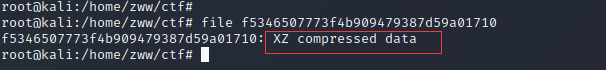
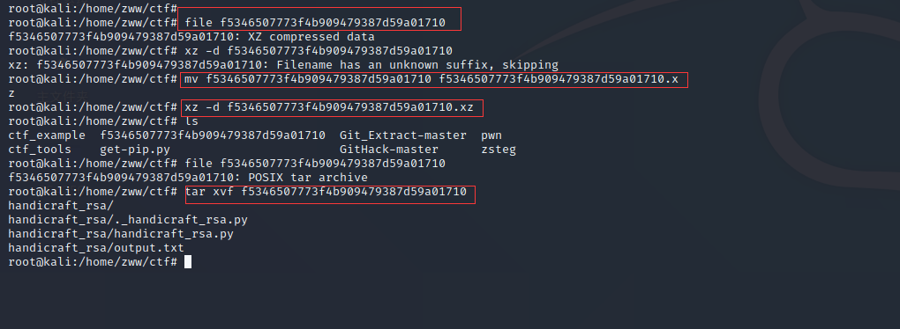
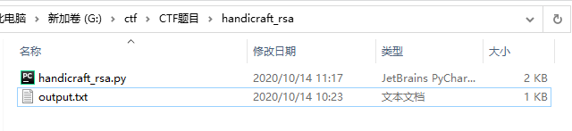
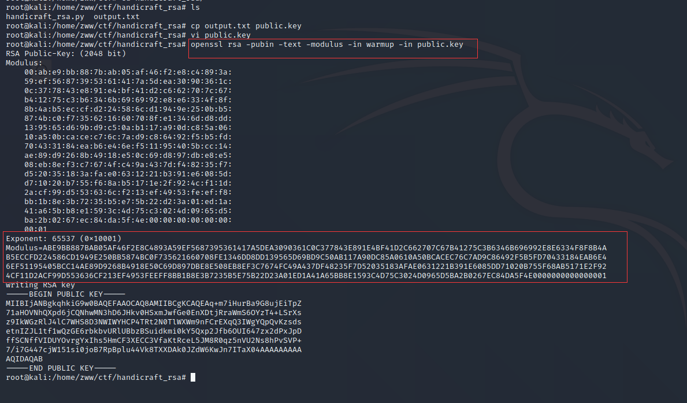
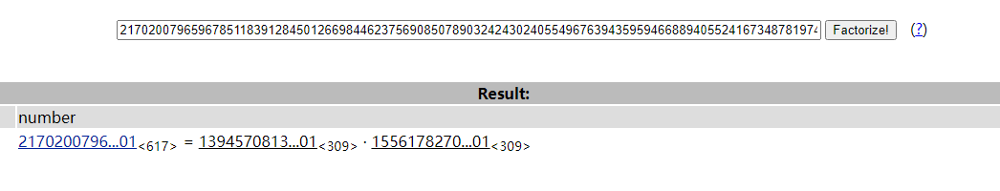
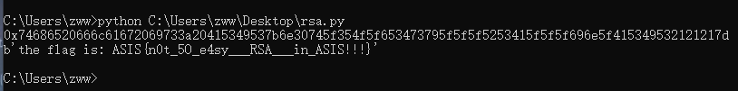

[题目地址](https://adworld.xctf.org.cn/task/answer?type=crypto&number=5&grade=1&id=4981&page=3)

题目名称：Handicraft_RSA

题目描述：

有人正在他老房子的地下室里开发自己的RSA系统。证明他这个RSA系统只在他的地下室有效。

题目附件：[附件1](https://adworld.xctf.org.cn/media/task/attachments/f5346507773f4b909479387d59a01710)

<!-- more -->

WriteUp

**解题过程：**

下载附件，先用010Editor打开查看16进制，也没看出是什么文件，也没有有含义的字符串

打开kaili虚拟机，用linux的file命令查看文件类型，发现是XZ压缩方式



也是第一次接触到xz压缩，百度搜索解压方式

1、首先使用xz解压文件

先给文件加上.xz后缀，否则会解压失败，然后加压

命令：`xz -d f5346507773f4b909479387d59a01710.xz`

注：使用 xz 进行压缩和解压过程中都会直接在原文件上进行，比如说对 tar.xz 解压后直接就剩下 tar 了，而没有了原 tar.xz 文件。可以加 -k 参数（keep）进行保留原文件

xz解压后就变成了tar压缩文件，继续解压得到了handicraft_rsa文件夹

命令：`tar -xvf f5346507773f4b909479387d59a01710`



2、拷贝到win10中接着进行分析

文件夹中有两个文件，output.txt文件是handicraft_rsa.py文件输出的结果



handicraft_rsa.py文件内容及分析过程如下：

```python
#!/usr/bin/python

from Crypto.Util.number import *
from Crypto.PublicKey import RSA
from secret import s, FLAG

#题目所给的python文件使用的是python2，与python3语法、函数有些许不同
#得到一个1024bit的质数,不理解函数体也没关系，用于分析s的数值，大致猜出s不会太大
def gen_prime(s):
    while True:
		#getPrime(s)返回一个随机N-Bit的质数
        r = getPrime(s)
        R = [r]
        t = int(5 * s / 2) + 1
        for i in range(0, t):
			#getRandomRange(a,b)函数得到一个在[a,b)之间的random
            R.append(r + getRandomRange(0, 4 * s ** 2))
		'''
		lambda作为一个表达式，定义了一个匿名函数，a,b为函数传参，a*b为函数体
		reduce(function,iterable[,initializer]) 函数会对参数序列中元素进行累积。
		也就是对iterable可迭代对象（如列表、元组）中的第1、2个元素进行函数操作，
		将得到的结果与第三个元素用function运算，最后得到一个结果，如果有init参数，
		则先将init与第一个元素进行运算
		'''
        p = reduce(lambda a, b: a * b, R, 2) + 1
        if isPrime(p):
            if len(bin(p)[2:]) == 1024:
                return p

#循环，直到得到2048bit的n
while True:
    p = gen_prime(s)
    q = gen_prime(s)
    n = p * q
    e = 65537
    d = inverse(e, (p-1)*(q-1))
    if len(bin(n)[2:]) == 2048:
        break

msg = FLAG
key = RSA.construct((long(n), long(e), long(d), long(p), long(p)))
#循环，加密s次
for _ in xrange(s):
	#RSA加密得到密文
    enc = key.encrypt(msg, 0)[0]
    msg = enc

#打印公钥文件
print key.publickey().exportKey()
print '-' * 76
#密文用base64加密然后打印出来，这是python2的写法
print enc.encode('base64')
print '-' * 76

```

output.txt文件内容如下：

```
-----BEGIN PUBLIC KEY-----
MIIBIjANBgkqhkiG9w0BAQEFAAOCAQ8AMIIBCgKCAQEAq+m7iHurBa9G8ujEiTpZ
71aHOVNhQXpd6jCQNhwMN3hD6JHkv0HSxmJwfGe0EnXDtjRraWmS6OYzT4+LSrXs
z9IkWGzRlJ4lC7WHS8D3NWIWYHCP4TRt2N0TlWXWm9nFCrEXqQ3IWgYQpQvKzsds
etnIZJL1tf1wQzGE6rbkbvURlUBbzBSuidkmi0kY5Qxp2Jfb6OUI647zx2dPxJpD
ffSCNffVIDUYOvrgYxIhs5HmCF3XECC3VfaKtRceL5JM8R0qz5nVU2Ns8hPvSVP+
7/i7G447cjW151si0joB7RpBplu44Vk8TXXDAk0JZdW6KwJn7ITaX04AAAAAAAAA
AQIDAQAB
-----END PUBLIC KEY-----
----------------------------------------------------------------------------
eER0JNIcZYx/t+7lnRvv8s8zyMw8dYspZlne0MQUatQNcnDL/wnHtkAoNdCalQkpcbnZeAz4qeMX
5GBmsO+BXyAKDueMA4uy3fw2k/dqFSsZFiB7I9M0oEkqUja52IMpkGDJ2eXGj9WHe4mqkniIayS4
2o4p9b0Qlz754qqRgkuaKzPWkZPKynULAtFXF39zm6dPI/jUA2BEo5WBoPzsCzwRmdr6QmJXTsau
5BAQC5qdIkmCNq7+NLY1fjOmSEF/W+mdQvcwYPbe2zezroCiLiPNZnoABfmPbWAcASVU6M0YxvnX
sh2YjkyLFf4cJSgroM3Aw4fVz3PPSsAQyCFKBA==

----------------------------------------------------------------------------

```

上半部分是RSA加密公钥，下半部分是base64编码后的base64

接下来就简单了，把公钥信息保存成public.key文件，然后在kali虚拟机里用openssl工具解出e、n

命令：`openssl rsa -pubin -text -modulus -in warmup -in public.key`



得到e、n，把n转成10进制然后在网站http://factordb.com/,解出p和q



到此，已经获取到RSA的全部参数p、q、n、e

3、使用python3脚本解出明文

```python
# -*- coding: cp936 -*-
import base64
from Crypto.PublicKey import RSA
def egcd(a,b):
    if a==0:
        return (b,0,1)
    else:
        g,y,x=egcd(b%a,a)
        return (g,x-(b//a)*y,y)
def modinv(a,m):
    g,x,y=egcd(a,m)
    if g!=1:
        raise Exception('modular inverse does not exist')
    else:
        return x%m
p=139457081371053313087662621808811891689477698775602541222732432884929677435971504758581219546068100871560676389156360422970589688848020499752936702307974617390996217688749392344211044595211963580524376876607487048719085184308509979502505202804812382023512342185380439620200563119485952705668730322944000000001

  
q = 155617827023249833340719354421664777126919280716316528121008762838820577123085292134385394346751341309377546683859340593439660968379640585296350265350950535158375685103003837903550191128377455111656903429282868722284520586387794090131818535032744071918282383650099890243578253423157468632973312000000000000001 
n = p*q
e = 65537
d=modinv(e,(p-1)*(q-1))#RSA私钥

enc='eER0JNIcZYx/t+7lnRvv8s8zyMw8dYspZlne0MQUatQNcnDL/wnHtkAoNdCalQkpcbnZeAz4qeMX5GBmsO+BXyAKDueMA4uy3fw2k/dqFSsZFiB7I9M0oEkqUja52IMpkGDJ2eXGj9WHe4mqkniIayS42o4p9b0Qlz754qqRgkuaKzPWkZPKynULAtFXF39zm6dPI/jUA2BEo5WBoPzsCzwRmdr6QmJXTsau5BAQC5qdIkmCNq7+NLY1fjOmSEF/W+mdQvcwYPbe2zezroCiLiPNZnoABfmPbWAcASVU6M0YxvnXsh2YjkyLFf4cJSgroM3Aw4fVz3PPSsAQyCFKBA=='
c=base64.b64decode(enc).hex()#base64解码后是bytes类型，转成16进制字符串
# with open(r"E:/flag.enc" , "rb") as f:
    # s=f.read().hex()#bytes转16进制字符串
c=int(c,16);#密文，16进制转成int型
#这里不知道循环次数s的数值，不过根据分析s不会太大
while True:
    #解出明文
    m=pow(c,d,n)#得到的是10进制数据
    c=m
    hex_data=hex(m)#得到16进制数据，最后转字符串就行了
    if '666c' in hex_data:
        print(hex_data)#输出16进制数据
        #因为base16编码后的字母组成是[0-9A-F],所以要转成大写，否则会提示“Non-base16 digit found”
        #还可以写成flag=base64.b16decode(hex[2:],True)或者修改python库base64源码里的b16decode()函数第二个参数为True
        flag=base64.b16decode(hex_data[2:].upper())
        print(flag)#输出解码后的字符串
        break
```

运行代码得到flag：ASIS{n0t_5O_e4sy___RSA___in_ASIS!!!}




中间有的步骤还有其它方法

可以参考我的另一篇RSA WriteUp  [RSA256](https://z2bns.github.io/2020/10/10/RSA256/)