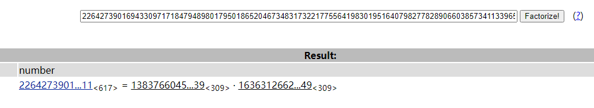

[题目地址](https://adworld.xctf.org.cn/task/answer?type=crypto&number=5&grade=1&id=5452&page=2)

题目名称：RSA_gcd

题目描述：暂无

题目附件：[附件1](https://adworld.xctf.org.cn/media/task/attachments/f1217fd42e8b43558077180e98c757d7.zip)

<!-- more -->

**解题思路：**

下载附件，解压得到两个文件


文件内容如下：


给出了模数n、公钥指数e、密文c，就是常规的RSA解密，属于常规破解模数，直接用脚本解密就好了。

**解题过程：**

登录网站http://factordb.com/,分别解出p和q，如下

attach1.txt：



attach2.txt：


python3脚本解密：

```python
# -*- coding: cp936 -*-
import base64
from Crypto.PublicKey import RSA
def egcd(a,b):
    if a==0:
        return (b,0,1)
    else:
        g,y,x=egcd(b%a,a)
        return (g,x-(b//a)*y,y)
def modinv(a,m):
    g,x,y=egcd(a,m)
    if g!=1:
        raise Exception('modular inverse does not exist')
    else:
        return x%m
p1 = 138376604533530412400239558340424700312412702699022481119357799054715877829291635290832719835033140580690053865677079316241919169166375123691917675235979462772103681398725285808551041924624882840901583892858174270714471366531758975241868470938138238307005782651296179579961869801841395682782645916848523771439
q1 = 167807411649676462546661119644113081915542378755778327057156191284453150887662343414908916953154897183613548083558919410359642450001343644814021159828724844730881111955050992398535063409828169462180970629537792676998647880110463527555034040871485964361418080481113059959410616446772218038141157051007091689351 
n1 = p1*q1

p2=  138376604533530412400239558340424700312412702699022481119357799054715877829291635290832719835033140580690053865677079316241919169166375123691917675235979462772103681398725285808551041924624882840901583892858174270714471366531758975241868470938138238307005782651296179579961869801841395682782645916848523771439
q2=  163631266233712837481823088378337134151021871060275887871338250274359922218053543333532579728777813509956261662615493179160669715503833949420308311581736674332268131534602581626817039237393599222688271607325131529790640375765697832746614700483681658911753936520482383592478743093233261371451718844275762094649
n2=p2*q2
e = 65537
d1=modinv(e,(p1-1)*(q1-1))#RSA私钥
d2=modinv(e,(p2-1)*(q2-1))#RSA私钥

c1=9700614748413503291260966231863562117502096284616216707445276355274869086619796527618473213422509996843430296526594113572675840559345077344419098900818709577642324900405582499683604786981144099878021784567540654040833912063141709913653416394888766281465200682852378794478801329251224801006820925858507273130504236563822120838520746270280731121442839412258397191963036040553539697846535038841541209050503061001070909725806574230090246041891486506980939294245537252610944799573920844235221096956391095716111629998594075762507345430945523492775915790828078000453705320783486744734994213028476446922815870053311973844961
c2=20513108670823938405207629835395350087127287494963553421797351726233221750526355985253069487753150978011340115173042210284965521215128799369083065796356395285905154260709263197195828765397189267866348946188652752076472172155755940282615212228370367042435203584159326078238921502151083768908742480756781277358357734545694917591921150127540286087770229112383605858821811640935475859936319249757754722093551370392083736485637225052738864742947137890363135709796410008845576985297696922681043649916650599349320818901512835007050425460872675857974069927846620905981374869166202896905600343223640296138423898703137236463508
#解出明文
m1=pow(c1,d1,n1)#得到的是10进制数据
m2=pow(c2,d2,n2)#得到的是10进制数据

hex1=hex(m1)#得到16进制数据，最后转字符串就行了
hex2=hex(m2)#得到16进制数据，最后转字符串就行了
hex=hex1+hex2[2:]
print(hex)#输出16进制数据
flag=base64.b16decode(hex[2:].upper())
print(flag)#输出解码后的字符串

```

解密结果：


得到flag{336BB5172ADE227FE68BAA44FDA73F3B}

