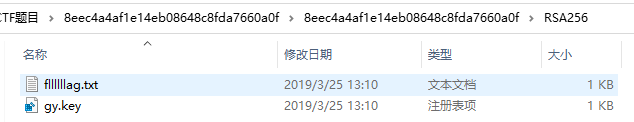
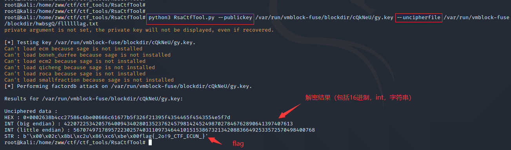
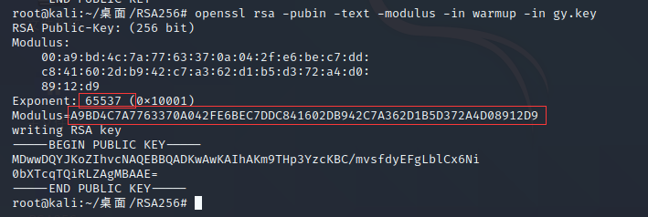
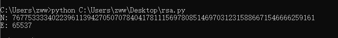
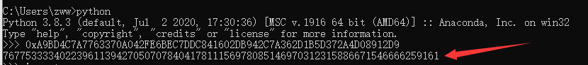
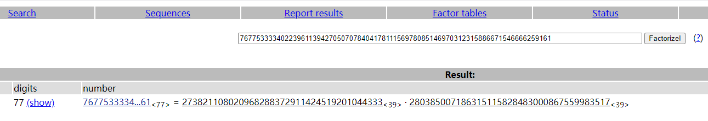
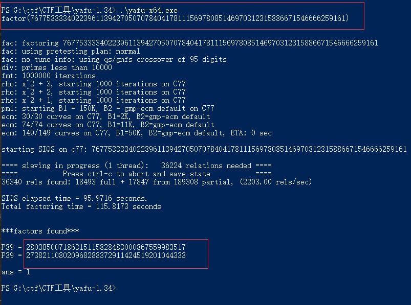
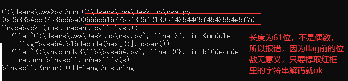

[题目地址](https://adworld.xctf.org.cn/task/answer?type=crypto&number=5&grade=1&id=5485&page=2)

题目名称：RSA256

题目描述：

被潘汉年按时来到上海百老汇大厦（今上海大厦），叩开了袁殊临时下榻处的房门。袁殊说明自己当前身份和处境后，突然话锋一转，问潘汉年：“你到我这里来，恐怕已经被日本特务注意到了。我应该怎么向他们解释呢？”潘汉年说：“你就将计就计在敌伪内部站住脚，取得合法地位。同时搜集敌伪情报向我提供。”“要是岩井要求我将你介绍给他怎么办？”“那我就用胡越明的化名同岩井见面，就说我愿意和你在香港合作搞情报。”时隔不久，潘汉年接到袁殊通知，通知内容为：RSA256.tar.gz，要他在上海虹口区一家日本人开的餐馆里，和岩井会见。 请以暗号形式告知我方人员前往保护潘汉年的安全。(答案为flag{XXX}形式)

题目附件：[附件1](https://adworld.xctf.org.cn/media/task/attachments/8eec4a4af1e14eb08648c8fda7660a0f.gz)

<!-- more -->

WriteUp：

**解题思路：**

下载附件，解压得到RSA256文件夹，里面有两个文件fllllllag.txt和gy.key



给出了公钥文件gy.key和密文文件fllllllag.txt，就是常规的RSA解密，有多种方法

**方法一：利用RsaCtfTool工具（kali虚拟机中）**

已知公钥（自动求私钥）--publickey,密文--uncipherfile

命令：`python3 RsaCtfTool.py --publickey 公钥文件 --uncipherfile 加密的文件`



直接解出明文

**方法二：利用公钥文件用openssl工具解出e、n，然后python3脚本解出明文**

**1、**解出e、n

方式1：

打开kali虚拟机，用openssl解出e、n

命令：`openssl rsa -pubin -text -modulus -in warmup -in gy.key`



方式2：

用脚本从公钥文件中解出n、e

```python
# -*- coding: cp936 -*-
from Crypto.PublicKey import RSA

#1.从公钥文件中分解n和e
public_key = RSA.importKey(open(r"G:\ctf\CTF题目\8eec4a4af1e14eb08648c8fda7660a0f\8eec4a4af1e14eb08648c8fda7660a0f\RSA256\gy.key",'rb').read())
n = public_key.n
e = public_key.e
print('N:',n)
print('E:',e)
```

运行结果



**2、**e为65537，n还比较短，用python先转换成10进制



对n进行因数分解

方式1：登录网站[http://factordb.com/](http://factordb.com/),解出p和q



方式2：使用yafu工具

(常用于比较大的整数分解)自动整数因式分解，在RSA中，当p、q的取值差异过大或过于相近的时候，使用yafu可以快速的把n值分解出p、q值！

用法：




到此，已经获取到RSA的全部参数

p = 273821108020968288372911424519201044333  

q = 280385007186315115828483000867559983517 

n=76775333340223961139427050707840417811156978085146970312315886671546666259161

e=65537

**3、**使用python3代码解出明文

```python
# -*- coding: cp936 -*-
import base64
from Crypto.PublicKey import RSA
def egcd(a,b):
    if a==0:
        return (b,0,1)
    else:
        g,y,x=egcd(b%a,a)
        return (g,x-(b//a)*y,y)
def modinv(a,m):
    g,x,y=egcd(a,m)
    if g!=1:
        raise Exception('modular inverse does not exist')
    else:
        return x%m
p = 273821108020968288372911424519201044333  
q = 280385007186315115828483000867559983517 
n = p*q
e = 65537
d=modinv(e,(p-1)*(q-1))#RSA私钥

with open(r"fllllllag.txt" , "rb") as f:
	s=f.read().hex()#bytes转16进制字符串
c=int(s,16);#密文，16进制转成int型
#解出明文
m=pow(c,d,n)#得到的是10进制数据
hex=hex(m)#得到16进制数据，最后转字符串就行了
print(hex)#输出16进制数据
#因为base16编码后的字母组成是[0-9A-F],所以要转成大写，否则会提示“Non-base16 digit found”
#还可以写成flag=base64.b16decode(hex[2:],True)或者修改python库base64源码里的b16decode()函数第二个参数为True
flag=base64.b16decode(hex[2:].upper())
print(flag)#输出解码后的字符串

```

运行结果如下：



可以看出flag字符串16进制标识，直接base16解码得到flag：

flag{\_2o!9_CTF_ECUN\_}

提交时需要去掉_(真坑)

