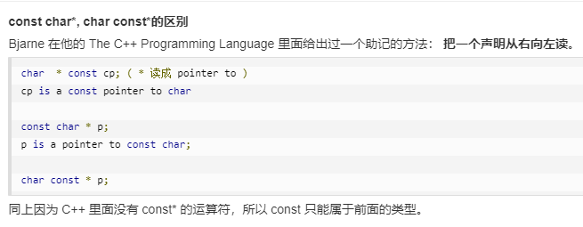

###### **1、环境配置**

文本编辑器（如notepad）和C++编译器（用于把源程序编译成最终的可执行程序）


<!-- more -->

###### **2、基本语法**

- C++ 标识符由字母、$ 、_ 、数字组成，但不能以数字开头。
- 在 C++ 中，分号是语句结束符。也就是说，每个语句必须以分号结束。

###### **3、注释**

- ​    //第一种注释,单行注释
- ​    /\*第二种注释，多行注释*/
- ​    第三种注释，程序调试方便，修改0-》1即可运行

```c++
  #if 0

  cout<<"第三种注释"<<endl;

  #endif // 0
```

###### **4、数据类型**

变量保留的是它所存储的值的内存位置。

7种基本数据类型

- 布尔型bool
- 字符串型char
- 整型int
- 浮点型float
- 双浮点型double
- 无类型void
- 宽字符型wchar_t

一些基本类型可以使用一个或多个类型修饰符进行修饰

派生数据类型

枚举enum

###### **5、变量类型**

变量定义就是告诉编译器在何处创建变量的存储，以及如何创建变量的存储。

变量声明向编译器保证变量以给定的类型和名称存在，这样编译器在不需要知道变量完整细节的情况下也能进一步的编译。变量声明只在编译时有它的意义，在程序连接时编译器需要实际的变量声明。

###### **6、变量作用域**

程序中，局部变量和全局变量的名称可以相同。

存储在静态数据区的变量会在程序刚开始运行时就完成初始化，也是唯一的一次初始化。共有两种变量存储在静态存储区：全局变量和static变量。

全局变量，静态局部变量，静态全局变量都在静态存储区分配空间，而局部变量在栈里分配空间。



###### **7、常量**

常量是固定值，在程序执行期间不会改变，又叫做字面量

常量通常定义为大写字母形式


###### **8、修饰符类型**

C++允许在char、int和double数据类型放置修饰符。修饰符用于改变基本类型的含义。

###### **9、存储类**

存储类定义C++程序中变量/函数的范围和生命周期。这些说明符放置在他们所修饰的类型之前。

###### **10、运算符**

运算符是一种告诉编译器执行特定的数学或逻辑操作的符号。

算术运算符

关系运算符

逻辑运算符

位运算符

赋值运算符

杂项运算符

###### **11、循环**

循环类型

- while循环
- for循环
- do...while循环
- 嵌套循环

循环控制语句

- break语句
- continue语句

###### **12、判断**

- 判断语句
- if语句
- if...else语句
- 嵌套if语句
- switch语句
- 嵌套switch语句

?:运算符

###### **13、函数**

逻辑上每个函数执行一个特定的任务

函数定义一般形式

return_type function_name( parameter list ) {   body of the function }

C++11 提供了对匿名函数的支持,称为 Lambda 函数(也叫 Lambda 表达式)。

###### **14、数字**

数学头文件 <cmath>一些内置数学函数

随机数生成器

###### **15、数组**

存储一个固定大小的相同类型元素的顺序集合，由连续内存位置组成

声明数组

初始化数组

访问数组元素

###### **16、字符串**

**C风格字符串**

**C++引入string类类型**

###### **17、指针**

**指针是一个变量，其值是另一个变量的地址**

定义一个指针变量、把变量地址赋值给指针、访问指针变量中可用地址的值

###### **18、引用**

引用变量是一个别名，一旦把引用初始化为某个变量，就可以使用该引用名称或变量名称来指向变量。

可以把引用当成是变量附属在内存位置中的第二个标签，& 读作**引用**

###### **19、日期&时间**

C++ 继承了 C 语言用于日期和时间操作的结构和函数。使用日期和时间需要引用 <ctime> 头文件。

四种类型：**clock_t、time_t、size_t** 和 **tm**

###### **20、基本输入输出**

 I/O 发生在流中，流是字节序列，字节流从设备（如键盘、磁盘驱动器、网络连接等）流向内存叫**输入操作**。从内存流向设备（如显示屏、打印机、磁盘驱动器、网络连接等），叫**输出操作**。

头文件<iostream>、<iomanip>、<fstream>

###### **21、数据结构**

**结构**是 C++ 中另一种用户自定义的可用的数据类型，它允许您存储不同类型的数据项。

使用 **struct** 语句定义结构。struct 语句定义了一个包含多个成员的新的数据类型

访问结构的成员，我们使用**成员访问运算符（.）**

#### **C++面向对象**

###### **22、类&对象**

C++ 支持面向对象程序设计。类是 C++ 的核心特性，通常被称为用户定义的类型。

类定义是以关键字 **class** 开头，后跟类的名称。类的主体是包含在一对花括号中。类定义后必须跟着一个分号或一个声明列表。

###### **23、继承**

面向对象程序设计中最重要的一个概念是继承。继承允许我们依据另一个类来定义一个类，达到了重用代码功能和提高执行效率的效果。

基类&派生类

访问控制和继承

###### **24、重载运算符和重载函数**

C++ 允许在同一作用域中的某个**函数**和**运算符**指定多个定义，分别称为**函数重载**和**运算符重载**。

调用一个**重载函数**或**重载运算符**时，编译器通过把您所使用的参数类型与定义中的参数类型进行比较，决定选用最合适的定义。

函数重载：同名函数的形式参数（指参数的个数、类型或者顺序）必须不同

重载运算符：函数名是由关键字 operator 和其后要重载的运算符符号构成的

###### **25、多态**

C++ 多态意味着调用成员函数时，会根据调用函数的对象的类型来执行不同的函数。

**虚函数** 是在基类中使用关键字 **virtual** 声明的函数。在派生类中重新定义基类中定义的虚函数时，会告诉编译器不要静态链接到该函数，动态链接

###### **26、数据抽象**

数据抽象是指，只向外界提供关键信息，并隐藏其后台的实现细节，即只表现必要的信息而不呈现细节。

数据抽象是一种依赖于接口和实现分离的编程（设计）技术

###### **27、数据封装**

**数据封装**是一种把数据和操作数据的函数捆绑在一起的机制，**数据抽象**是一种仅向用户暴露接口而把具体的实现细节隐藏起来的机制。

###### **28、接口（抽象类）**

接口描述了类的行为和功能，而不需要完成类的特定实现。

抽象类类中至少有一个函数被声明为纯虚函数

抽象类不能被用于实例化对象，它只能作为**接口**使用

#### **C++高级教程**

###### **29、文件和流**

**fstream标准库，数据类型ofstream、ifstream、fstream**

###### **30、异常处理**

异常是程序在执行期间产生的问题，C++ 异常处理涉及到三个关键字：**try、catch、throw**。

可以通过继承和重载 **exception** 类来定义新的异常

###### **31、动态内存**

C++ 程序中的内存分为两个部分：

- **栈：**在函数内部声明的所有变量都将占用栈内存。
- **堆：**这是程序中未使用的内存，在程序运行时可用于动态分配内存。

###### **32、命名空间**

本质上，命名空间就是定义了一个范围

命名空间的定义使用关键字 **namespace**，后跟命名空间的名称

为了调用带有命名空间的函数或变量，需要在前面加上命名空间的名称

可以使用 **using namespace** 指令，这样在使用命名空间时就可以不用在前面加上命名空间的名称。这个指令会告诉编译器，后续的代码将使用指定的命名空间中的名称。

###### **33、模板**

模板是泛型编程的基础，泛型编程即以一种独立于任何特定类型的方式编写代码

###### **34、预处理器**

预处理器是一些指令，指示编译器在实际编译之前所需完成的预处理。

所有的预处理器指令都是以井号（#）开头，只有空格字符可以出现在预处理指令之前

参数宏

条件编译

###### **35、信号处理**

信号是由操作系统传给进程的中断，会提早终止一个程序

**Sleep 函数**

功能：执行挂起一段时间，也就是等待一段时间在继续执行

用法：**Sleep(时间)**

Linux 用 **#include <unistd.h>** 和 **sleep()**，Windos 用 **#include <windows.h>** 和 **Sleep()**。

###### **36、多线程**

多线程是多任务处理的一种特殊形式，多任务处理允许让电脑同时运行两个或两个以上的程序。一般情况下，两种类型的多任务处理：**基于进程和基于线程**。

- 基于进程的多任务处理是程序的并发执行。
- 基于线程的多任务处理是同一程序的片段的并发执行。

###### **37、Web编程**

公共网关接口（CGI），是一套标准，定义了信息是如何在 Web 服务器和客户端脚本之间进行交换的。

#### **C++资源库**

###### **38、STL教程**

C++ STL（标准模板库）是一套功能强大的 C++ 模板类，提供了通用的模板类和函数，这些模板类和函数可以实现多种流行和常用的算法和数据结构，如向量、链表、队列、栈。

核心组件：容器（Containers）算法（Algorithms）迭代器（iterators）

###### **39、标准库**

**标准函数库：** 这个库是由通用的、独立的、不属于任何类的函数组成的。函数库继承自 C 语言。

- 输入/输出 I/O
- 字符串和字符处理
- 数学
- 时间、日期和本地化
- 动态分配
- 其他
- 宽字符函数

**面向对象类库：** 这个库是类及其相关函数的集合。

- 标准的 C++ I/O 类
- String 类
- 数值类
- STL 容器类
- STL 算法
- STL 函数对象
- STL 迭代器
- STL 分配器
- 本地化库
- 异常处理类
- 杂项支持库

###### **40、有用的资源**

网站

- [C++ Standard Library headers](https://en.cppreference.com/w/cpp/header) − C++ 标准库。
- [C++ Programming](http://en.wikibooks.org/wiki/C++_Programming) − 这本书涵盖了 C++ 语言编程、软件交互设计、C++ 语言的现实生活应用。
- [C++ FAQ](http://www.sunistudio.com/cppfaq/) − C++ 常见问题
- [Free Country](http://www.thefreecountry.com/sourcecode/cpp.shtml) − Free Country 提供了免费的 C++ 源代码和 C++ 库，这些源代码和库涵盖了压缩、存档、游戏编程、标准模板库和 GUI 编程等 C++ 编程领域。
- [C and C++ Users Group](http://www.hal9k.com/cug/) − C 和 C++ 的用户团体提供了免费的涵盖各种编程领域 C++ 项目的源代码，包括 AI、动画、编译器、数据库、调试、加密、游戏、图形、GUI、语言工具、系统编程等。

书籍

- 《Essential C++ 中文版》
- 《C++ Primer Plus 第6版中文版》
- 《C++ Primer中文版（第5版）》

###### **41、实例**

- [C++ 实例 - 输出 "Hello, World!"](https://www.runoob.com/cplusplus/cpp-examples-cout-helloworld.html)
- [C++ 实例 - 标准输入输出](https://www.runoob.com/cplusplus/cpp-examples-cout-cin.html)
- [C++ 实例 - 输出换行](https://www.runoob.com/cplusplus/cpp-examples-endl.html)
- [C++ 实例 - 实现两个数相加](https://www.runoob.com/cplusplus/cpp-examples-add-numbers.html)
- [C++ 实例 - 创建不同类型的变量](https://www.runoob.com/cplusplus/cpp-examples-data-types.html)
- [C++ 实例 - 求商及余数](https://www.runoob.com/cplusplus/cpp-examples-quotient-remainder.html)
- [C++ 实例 - 查看 int, float, double 和 char 变量大小](https://www.runoob.com/cplusplus/cpp-examples-sizeof-operator.html)
- [C++ 实例 - 交换两个数](https://www.runoob.com/cplusplus/cpp-examples-swapping.html)
- [C++ 实例 - 判断一个数是奇数还是偶数](https://www.runoob.com/cplusplus/cpp-examples-even-odd.html)
- [C++ 实例 - 判断元音/辅音](https://www.runoob.com/cplusplus/cpp-examples-vowel-consonant.html)
- [C++ 实例 - 判断三个数中的最大数](https://www.runoob.com/cplusplus/cpp-examples-largest-number-among-three.html)
- [C++ 实例 - 求一元二次方程的根](https://www.runoob.com/cplusplus/cpp-examples-quadratic-roots.html)
- [C++ 实例 - 计算自然数之和](https://www.runoob.com/cplusplus/cpp-examples-sum-natural-number.html)
- [C++ 实例 - 判断闰年](https://www.runoob.com/cplusplus/cpp-examples-leap-year.html)
- [C++ 实例 - 求一个数的阶乘](https://www.runoob.com/cplusplus/cpp-examples-factorial.html)
- [C++ 实例 - 创建各类三角形图案](https://www.runoob.com/cplusplus/cpp-examples-pyramid-pattern.html)
- [C++ 实例 - 求两数的最大公约数](https://www.runoob.com/cplusplus/cpp-examples-hcf-gcd.html)
- [C++ 实例 - 求两数最小公倍数](https://www.runoob.com/cplusplus/cpp-examples-lcm.html)
- [C++ 实例 - 实现一个简单的计算器](https://www.runoob.com/cplusplus/cpp-examples-calculator-switch-case.html)
- [猴子吃桃问题](https://www.runoob.com/cplusplus/cpp-examples-monkey-eating-peach.html)