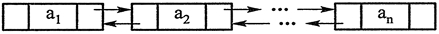
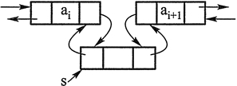

#### 说明：

本文仅为个人学习使用，非原创来源如下：[C语言中文网](http://c.biancheng.net/cplus/80/)

C++ 语言的核心优势之一就是便于软件的重用。C++ 中有两个方面体现重用：

- 一是面向对象的继承和多态机制；
- 二是通过模板的概念实现了对泛型程序设计的支持。


C++ 的标准模板库（Standard Template Library，STL）是泛型程序设计最成功应用的实例。STL 是一些常用数据结构（如链表、可变长数组、排序二叉树）和算法（如排序、查找）的模板的集合，主要由 Alex Stepanov 主持开发，于 1998 年被加入 C++ 标准。

有了 STL，程序员就不必编写大多数常用的数据结构和算法。而且 STL 是经过精心设计的，运行效率很高，比水平一般的程序员编写的同类代码速度更快。

有一种说法，C++ 是用来编写大程序的，如果只是编写几十上百行的小程序，用C语言就可以，没有必要用 C++。

这个说法是不准确的。可以说，写小程序没必要用面向对象的方法，但是用 C++ 还是能够带来很大方便的，因为 C++ 中有 STL。哪怕编写只有十几行的程序，也可能会用到 STL 中提供的数据结构和算法。例如对数组排序，用 STL 中的 sort 算法往往只需要一条语句就能解决，而不用像调用C语言库函数 qsort 那样还要编写比较函数。

<!-- more -->

#### C++容器（STL容器）

容器（container）用于存放数据的类模板。可变长数组、链表、平衡二叉树等[数据结构](http://c.biancheng.net/data_structure/)在 [STL](http://c.biancheng.net/stl/) 中都被实现为容器。

程序员使用容器时，即将容器类模板实例化为容器类时，会指明容器中存放的元素是什么类型的。

容器中可以存放基本类型的变量，也可以存放对象。对象或基本类型的变量被插入容器中时，实际插入的是对象或变量的一个复制品。

STL 中的许多算法（即函数模板），如排序、查找等算法，在执行过程中会对容器中的元素进行比较。这些算法在比较元素是否相等时通常用运算符进行，比较大小通常用`<`运算符进行，因此，被放入容器的对象所属的类最好重载`==`和`<`运算符，以使得两个对象用`==`和`<`进行比较是有定义的。

容器分为两大类。

**顺序容器**

顺序容器有以下三种：可变长动态数组 vector、双端队列 deque、双向链表 list。

它们之所以被称为顺序容器，是因为元素在容器中的位置同元素的值无关，即容器不是排序的。将元素插入容器时，指定在什么位置（尾部、头部或中间某处）插入，元素就会位于什么位置。

**关联容器**

关联容器有以下四种：set、multiset、map、multimap。关联容器内的元素是排序的。插入元素时，容器会按一定的排序规则将元素放到适当的位置上，因此插入元素时不能指定位置。

默认情况下，关联容器中的元素是从小到大排序（或按关键字从小到大排序）的，而且用`<`运算符比较元素或关键字大小。因为是排好序的，所以关联容器在查找时具有非常好的性能。

除了以上两类容器外，STL 还在两类容器的基础上屏蔽一部分功能，突出或增加另一部分功能，实现了三种容器适配器：栈 stack、队列 queue、优先级队列 priority_queue。

为称呼方便起见，本教程后面将容器和容器适配器统称为容器。

容器都是类模板。它们实例化后就成为容器类。用容器类定义的对象称为容器对象。

例如，`vector<int>`是一个容器类的名字，`vector<int> a;`就定义了一个容器对象 a，a 代表一个长度可变的数组，数组中的每个元素都是 int 类型的变量；`vector<double> b;`定义了另一个容器对象 b，a 和 b 的类型是不同的。本教程后文所说的“容器”，有时也指“容器对象”，读者需要根据上下文自行判别。

任何两个容器对象，只要它们的类型相同，就可以用 <、<=、>、>=、==、!= 进行词典式的比较运算。假设 a、b 是两个类型相同的容器对象，这些运算符的运算规则如下。

- a == b：若 a 和 b 中的元素个数相同，且对应元素均相等，则`a == b`的值为 true，否则值为 false。元素是否相等是用`==`运算符进行判断的。
- a<b：规则类似于词典中两个单词比较大小，从头到尾依次比较每个元素，如果发生 a 中的元素小于 b 中的元素的情况，则`a<b`的值为 true；如果没有发生 b 中的元素小于 a 中的元素的情况，且 a 中的元素个数比 b 少，`a<b`的值也为 true；其他情况下值为 false。元素比较大小是通过`<`运算符进行的。
- a != b：等价于 !(a == b)。
- a > b：等价于 b < a。
- a <= b：等价于 !(b < a)。
- a >= b：等价于 !(a < b)。


所有容器都有以下两个成员函数：

- int size()：返回容器对象中元素的个数。
- bool empty()：判断容器对象是否为空。


顺序容器和关联容器还有以下成员函数：

- begin()：返回指向容器中第一个元素的迭代器。
- end()：返回指向容器中最后一个元素后面的位置的迭代器。
- rbegin()：返回指向容器中最后一个元素的反向迭代器。
- rend()：返回指向容器中第一个元素前面的位置的反向迭代器。
- erase(...)：从容器中删除一个或几个元素。该函数参数较复杂，此处省略。
- clear()：从容器中删除所有元素。


如果一个容器是空的，则 begin() 和 end() 的返回值相等，rbegin() 和 rend() 的返回值也相等。

顺序容器还有以下常用成员函数：

- front()：返回容器中第一个元素的引用。
- back()：返回容器中最后一个元素的引用。
- push_back()：在容器末尾增加新元素。
- pop_back()：删除容器末尾的元素。
- insert(...)：插入一个或多个元素。该函数参数较复杂，此处省略。

#### C++迭代器（STL迭代器）iterator详解

要访问顺序容器和关联容器中的元素，需要通过“迭代器（iterator）”进行。迭代器是一个变量，相当于容器和操纵容器的算法之间的中介。迭代器可以指向容器中的某个元素，通过迭代器就可以读写它指向的元素。从这一点上看，迭代器和[指针](http://c.biancheng.net/c/80/)类似。

迭代器按照定义方式分成以下四种。

1) 正向迭代器，定义方法如下：

```c++
容器类名::iterator 迭代器名;
```


2) 常量正向迭代器，定义方法如下：

```c++
容器类名::const_iterator 迭代器名;
```

3) 反向迭代器，定义方法如下：

```c++
容器类名::reverse_iterator 迭代器名;
```

4) 常量反向迭代器，定义方法如下：

```c++
容器类名::const_reverse_iterator 迭代器名;
```

**迭代器用法示例**

通过迭代器可以读取它指向的元素，`*迭代器名`就表示迭代器指向的元素。通过非常量迭代器还能修改其指向的元素。

迭代器都可以进行`++`操作。反向迭代器和正向迭代器的区别在于：

- 对正向迭代器进行`++`操作时，迭代器会指向容器中的后一个元素；
- 而对反向迭代器进行`++`操作时，迭代器会指向容器中的前一个元素。


下面的程序演示了如何通过迭代器遍历一个 vector 容器中的所有元素。

```c++
#include <iostream>
#include <vector>
using namespace std;
int main()
{
    vector<int> v;  //v是存放int类型变量的可变长数组，开始时没有元素
    for (int n = 0; n<5; ++n)
        v.push_back(n);  //push_back成员函数在vector容器尾部添加一个元素
    vector<int>::iterator i;  //定义正向迭代器
    for (i = v.begin(); i != v.end(); ++i) {  //用迭代器遍历容器
        cout << *i << " ";  //*i 就是迭代器i指向的元素
        *i *= 2;  //每个元素变为原来的2倍
    }
    cout << endl;
    //用反向迭代器遍历容器
    for (vector<int>::reverse_iterator j = v.rbegin(); j != v.rend(); ++j)
        cout << *j << " ";
    return 0;
}
```

程序的输出结果是：
0 1 2 3 4
8 6 4 2 0

第 6 行，vector 容器有多个构造函数，如果用无参构造函数初始化，则容器一开始是空的。

第 10 行，begin 成员函数返回指向容器中第一个元素的迭代器。++i 使得 i 指向容器中的下一个元素。end 成员函数返回的不是指向最后一个元素的迭代器，而是指向最后一个元素后面的位置的迭代器，因此循环的终止条件是`i != v.end()`。

第 16 行定义了反向迭代器用以遍历容器。反向迭代器进行`++`操作后，会指向容器中的上一个元素。rbegin 成员函数返回指向容器中最后一个元素的迭代器，rend 成员函数返回指向容器中第一个元素前面的位置的迭代器，因此本循环实际上是从后往前遍历整个数组。

如果迭代器指向了容器中最后一个元素的后面或第一个元素的前面，再通过该迭代器访问元素，就有可能导致程序崩溃，这和访问 NULL 或未初始化的指针指向的地方类似。

第 10 行和第 16 行，写`++i`、`++j`相比于写`i++`、`j++`，程序的执行速度更快。回顾`++`被重载成前置和后置运算符的例子如下：

```c++
CDemo CDemo::operator++ ()
{  //前置++
    ++n;
    return *this;
}
CDemo CDemo::operator ++(int k)
{  //后置++
    CDemo tmp(*this);  //记录修改前的对象
    n++;
    return tmp;  //返回修改前的对象
}
```

后置`++`要多生成一个局部对象 tmp，因此执行速度比前置的慢。同理，迭代器是一个对象，[STL](http://c.biancheng.net/stl/) 在重载迭代器的`++`运算符时，后置形式也比前置形式慢。在次数很多的循环中，`++i`和`i++`可能就会造成运行时间上可观的差别了。因此，本教程在前面特别提到，对循环控制变量i，要养成写`++i`、不写`i++`的习惯。

注意，容器适配器 stack、queue 和 priority_queue 没有迭代器。容器适配器有一些成员函数，可以用来对元素进行访问。

**迭代器的功能分类**

不同容器的迭代器，其功能强弱有所不同。容器的迭代器的功能强弱，决定了该容器是否支持 STL 中的某种算法。例如，排序算法需要通过随机访问迭代器来访问容器中的元素，因此有的容器就不支持排序算法。

常用的迭代器按功能强弱分为输入、输出、正向、双向、随机访问五种，这里只介绍常用的三种。

1) 正向迭代器。假设 p 是一个正向迭代器，则 p 支持以下操作：++p，p++，*p。此外，两个正向迭代器可以互相赋值，还可以用`==`和`!=`运算符进行比较。

2) 双向迭代器。双向迭代器具有正向迭代器的全部功能。除此之外，若 p 是一个双向迭代器，则`--p`和`p--`都是有定义的。`--p`使得 p 朝和`++p`相反的方向移动。

3) 随机访问迭代器。随机访问迭代器具有双向迭代器的全部功能。若 p 是一个随机访问迭代器，i 是一个整型变量或常量，则 p 还支持以下操作：

- p+=i：使得 p 往后移动 i 个元素。
- p-=i：使得 p 往前移动 i 个元素。
- p+i：返回 p 后面第 i 个元素的迭代器。
- p-i：返回 p 前面第 i 个元素的迭代器。
- p[i]：返回 p 后面第 i 个元素的引用。


此外，两个随机访问迭代器 p1、p2 还可以用 <、>、<=、>= 运算符进行比较。`p1<p2`的含义是：p1 经过若干次（至少一次）`++`操作后，就会等于 p2。其他比较方式的含义与此类似。

对于两个随机访问迭代器 p1、p2，表达式`p2-p1`也是有定义的，其返回值是 p2 所指向元素和 p1 所指向元素的序号之差（也可以说是 p2 和 p1 之间的元素个数减一）。

表1所示为不同容器的迭代器的功能。


| 容器           | 迭代器功能   |
| -------------- | ------------ |
| vector         | 随机访问     |
| deque          | 随机访问     |
| list           | 双向         |
| set / multiset | 双向         |
| map / multimap | 双向         |
| stack          | 不支持迭代器 |
| queue          | 不支持迭代器 |
| priority_queue | 不支持迭代器 |


例如，vector 的迭代器是随机迭代器，因此遍历 vector 容器有以下几种做法。下面的程序中，每个循环演示了一种做法。

【实例】遍历 vector 容器。

```c++
#include <iostream>
#include <vector>
using namespace std;
int main()
{
    vector<int> v(100); //v被初始化成有100个元素
    for(int i = 0;i < v.size() ; ++i) //size返回元素个数
        cout << v[i]; //像普通数组一样使用vector容器
    vector<int>::iterator i;
    for(i = v.begin(); i != v.end (); ++i) //用 != 比较两个迭代器
        cout << * i;
    for(i = v.begin(); i < v.end ();++i) //用 < 比较两个迭代器
        cout << * i;
    i = v.begin();
    while(i < v.end()) { //间隔一个输出
        cout << * i;
        i += 2; // 随机访问迭代器支持 "+= 整数"  的操作
    }
}
```

list 容器的迭代器是双向迭代器。假设 v 和 i 的定义如下：

```c++
list<int> v;
list<int>::const_iterator i;
```

则以下代码是合法的：

```c++
for(i=v.begin(); i!=v.end(); ++i)
    cout << *i;
```

以下代码则不合法：

```c++
for(i=v.begin(); i<v.end(); ++i)
    cout << *i;
```

因为双向迭代器不支持用“<”进行比较。以下代码也不合法：

```c++
for(int i=0; i<v.size(); ++i)
    cout << v[i];
```

因为 list 不支持随机访问迭代器的容器，也不支持用下标随机访问其元素。

在 [C++](http://c.biancheng.net/cplus/) 中，数组也是容器。数组的迭代器就是指针，而且是随机访问迭代器。例如，对于数组 int a[10]，int * 类型的指针就是其迭代器。则 a、a+1、a+2 都是 a 的迭代器。

**迭代器的辅助函数**

STL 中有用于操作迭代器的三个函数模板，它们是：

- advance(p, n)：使迭代器 p 向前或向后移动 n 个元素。
- dis[tan](http://c.biancheng.net/ref/tan.html)ce(p, q)：计算两个迭代器之间的距离，即迭代器 p 经过多少次 + + 操作后和迭代器 q 相等。如果调用时 p 已经指向 q 的后面，则这个函数会陷入死循环。
- iter_swap(p, q)：用于交换两个迭代器 p、q 指向的值。


要使用上述模板，需要包含头文件 algorithm。下面的程序演示了这三个函数模板的 用法。

```c++
#include <list>
#include <iostream>
#include <algorithm> //要使用操作迭代器的函数模板，需要包含此文件
using namespace std;
int main()
{
    int a[5] = { 1, 2, 3, 4, 5 };
    list <int> lst(a, a+5);
    list <int>::iterator p = lst.begin();
    advance(p, 2);  //p向后移动两个元素，指向3
    cout << "1)" << *p << endl;  //输出 1)3
    advance(p, -1);  //p向前移动一个元素，指向2
    cout << "2)" << *p << endl;  //输出 2)2
    list<int>::iterator q = lst.end();
    q--;  //q 指向 5
    cout << "3)" << distance(p, q) << endl;  //输出 3)3
    iter_swap(p, q); //交换 2 和 5
    cout << "4)";
    for (p = lst.begin(); p != lst.end(); ++p)
        cout << *p << " ";
    return 0;
}
```

程序的输出结果是：
1) 3
2) 2
3) 3
4) 1 5 3 4 2

#### STL算法详解

[STL](http://c.biancheng.net/stl/) 提供能在各种容器中通用的算法（大约有70种），如插入、删除、查找、排序等。算法就是函数模板。算法通过迭代器来操纵容器中的元素。

许多算法操作的是容器上的一个区间（也可以是整个容器），因此需要两个参数，一个是区间起点元素的迭代器，另一个是区间终点元素的后面一个元素的迭代器。例如，排序和查找算法都需要这两个参数来指明待排序或待查找的区间。

有的算法返回一个迭代器。例如，find 算法在容器中查找一个元素，并返回一个指向该元素的迭代器。

算法可以处理容器，也可以处理普通的数组。

有的算法会改变其所作用的容器。例如：

- copy：将一个容器的内容复制到另一个容器。
- remove：在容器中删除一个元素。
- random_shuffle：随机打乱容器中的元素。
- fill：用某个值填充容器。


有的算法不会改变其所作用的容器。例如：

- find：在容器中查找元素。
- count_if：统计容器中符合某种条件的元素的个数。


STL 中的大部分常用算法都在头文件 algorithm 中定义。此外，头文件 numeric 中也有一些算法。

下面介绍一个常用算法 find，以便对算法是什么、怎么用有一个基本的概念。find 算法和其他算法一样都是函数模板。find 模板的原型如下：

```c++
template <class InIt, class T>
InIt find(InIt first, InIt last, const T& val);
```

其功能可以是在迭代器 first、last 指定的容器的一个区间 [first, last) 中，按顺序查找和 val 相等的元素。如果找到，就返回该元素的迭代器；如果找不到，就返回 last。

> [first, last) 这个区间是一个左闭右开的区间，即 last 指向的元素其实不在此区间内。

find 模板使用`==`运算符判断元素是否相等。因此，如果 [first, last) 区间中存放的是对象，则`==`运算符应该被适当重载，使得两个对象可以用`==`运算符比较。

注意：上一段话说的是“其功能可以是”，而不是“其功能就是”。这是因为模板只是一种代码形式，这种代码形式具体能完成什么功能，取决于程序员对该模板写法的了解及其想象力。按照语法，调用 find 模板时，first 和 last 只要类型相同就可以，不一定必须是迭代器。

演示 find 用法的程序如下：

```c++
#include <vector>
#include <algorithm>
#include <iostream>
using namespace std;
int main()  {
    int a[10] = {10,20,30,40};
    vector<int> v;
    v.push_back(1);    v.push_back(2);
    v.push_back(3);    v.push_back(4); //此后v里放着4个元素：1,2,3,4
    vector<int>::iterator p;
    p = find(v.begin(),v.end(),3); //在v中查找3
    if(p != v.end()) //若找不到,find返回 v.end()
        cout << "1) " <<  * p << endl; //找到了
    p = find(v.begin(),v.end(),9);
    if(p == v.end())
        cout << "not found " << endl; //没找到
    p = find(v.begin()+1,v.end()-1,4); //在,3 这两个元素中查找4
    cout << "2) " << * p << endl;
    int * pp = find(a,a+4,20);
    if(pp == a + 4)
        cout << "not found" << endl;
    else
        cout << "3) " <<* pp << endl;
}
```

程序的输出结果是：
1) 3
not found
2) 4
3) 20

第 11 行，要查找的区间是 [v.begin(), v.end( ))，v.end() 不在查找范围内，因此没有问题。本行的查找会成功，因此 p 指向找到的元素 3。

第 17 行，因为要查找的区间是 [v.begin()+l，v.end()-1)，这个区间中只有 2、3 这两个元素，因此查找会失败，p 的值变为 v.end() - 1，因此 p 正好指向 4 这个元素。

第 19 行，数组 a 是一个容器。数组名 a 的类型是 int *，可以做迭代器使用，表达式`a+4`的类型也是 int*，因此也能做迭代器。本次调用 find,查找区间是 [a, a+4)，即数组 a 的前 4 个元素。如果查找失败，find 就会返回 a+4。

STL 中还有一个常用的算法 sort，用于对容器排序，其原型为：

```c++
template<class_RandIt>
void sort(_RandIt first, _RandIt last);
```

该算法可以用来对区间 [first, last) 从小到大进行排序。下面两行程序就能对数组 a 排序：

```c++
int a[4] = {3, 4, 2, 1};
sort(a, a+4);
```

#### STL中 ”大“、”小“ 和 ”相等“ 的概念

[STL](http://c.biancheng.net/stl/) 中关联容器内部的元素是排序的。STL 中的许多算法也涉及排序、查找。这些容器和算法都需要对元素进行比较，有的比较是否相等，有的比较元素大小。

在 STL 中，默认情况下，比较大小是通过`<`运算符进行的，和`>`运算符无关。在STL中提到“大”、“小”的概念时，以下三个说法是等价的：

- x 比 y 小。
- 表达式`x<y`为真。
- y 比 x 大。


一定要注意，`y比x大`意味着`x<y为真`，而不是`y>x为真`。`y>x`的结果如何并不重要，甚至`y>x`是没定义的都没有关系。

在 STL 中，`x和y相等`也往往不等价于`x==y为真`。对于在未排序的区间上进行的算法，如顺序查找算法 find，查找过程中比较两个元素是否相等用的是`==`运算符；但是对于在排好序的区间上进行查找、合并等操作的算法（如折半查找算法 binary_search，关联容器自身的成员函数 find）来说，`x和y相等`是与`x<y和y<x同时为假`等价的，与`==`运算符无关。看上去`x<y和y<x同时为假`就应该和`x==y为真`等价，其实不然。例如下面的 class A：

```c++
class A
{
    int v;
public:
    bool operator< (const A & a)const {return false;}
};
```

可以看到，对任意两个类 A 的对象 x、y，`x<y`和`y<x`都是为假的。也就是说，对 STL 的关联容器和许多算法来说，任意两个类 A 的对象都是相等的，这与`==`运算符的行为无关。

综上所述，使用 STL 中的关联容器和许多算法时，往往需要对`<`运算符进行适当的重载，使得这些容器和算法可以用`<`运算符对所操作的元素进行比较。最好将`<`运算符重载为全局函数，因为在重载为成员函数时，在有些编译器上会出错（由其 STL 源代码的写法导致）。

#### C++ vector，STL vector（可变长的动态数组）详解

vector 是顺序容器的一种。vector 是可变长的动态数组，支持随机访问迭代器，所有 [STL](http://c.biancheng.net/stl/) 算法都能对 vector 进行操作。要使用 vector，需要包含头文件 vector。

在 vector 容器中，根据下标随机访问某个元素的时间是常数，在尾部添加一个元素的时间大多数情况下也是常数，总体来说速度很快。

在中间插入或删除元素时，因为要移动多个元素，因此速度较慢，平均花费的时间和容器中的元素个数成正比。

在 vector 容器中，用一个动态分配的数组来存放元素，因此根据下标访问某个元素的时间是固定的，与元素个数无关。

vector 容器在实现时，动态分配的存储空间一般都大于存放元素所需的空间。例如，哪怕容器中只有一个元素，也会分配 32 个元素的存储空间。这样做的好处是，在尾部添加一个新元素时不必重新分配空间，直接将新元素写入适当位置即可。在这种情况下，添加新元素的时间也是常数。

但是，如果不断添加新元素，多出来的空间就会用完，此时再添加新元素，就不得不重新分配内存空间，把原有内容复制过去后再添加新的元素。碰到这种情况，添加新元素所花的时间就不是常数，而是和数组中的元素个数成正比。

至于在中间插入或删除元素，必然涉及元素的移动，因此时间不是固定的，而是和元素个数有关。

vector 有很多成员函数，常用的如表 1 所示。


| 成员函数                                                    | 作 用                                                        |
| ----------------------------------------------------------- | ------------------------------------------------------------ |
| vector()                                                    | 无参构造函数，将容器初始化为空                               |
| vector(int n)                                               | 将容器初始化为有 n 个元素                                    |
| vector(int n, const T & val)                                | 假定元素的类型是 T，此构造函数将容器初始化为有 n 个元素，每 个元素的值都是 val |
| vector(iterator first, iterator last)                       | first 和 last 可以是其他容器的迭代器。一般来说，本构造函数初始化的结果就是将 vector 容器的内容变成与其他容器上的区间 [first, last) —致 |
| void clear()                                                | 删除所有元素                                                 |
| bool empty()                                                | 判断容器是否为空                                             |
| void pop_back()                                             | 删除容器末尾的元素                                           |
| void push_back( const T & val)                              | 将 val 添加到容器末尾                                        |
| int size()                                                  | 返回容器中元素的个数                                         |
| T & front()                                                 | 返回容器中第一个元素的引用                                   |
| T & back()                                                  | 返回容器中最后一个元素的引用                                 |
| iterator insert(iterator i, const T & val)                  | 将 val 插入迭代器 i 指向的位置，返回 i                       |
| iterator insert( iterator i, iterator first, iterator last) | 将其他容器上的区间 [first, last) 中的元素插入迭代器 i 指向的位置 |
| iterator erase(iterator i)                                  | 删除迭代器 i 指向的元素，返回值是被删元素后面的元素的迭代器  |
| iterator erase(iterator first, iterator last)               | 删除容器中的区间 [first, last)                               |
| void swap( vector <T> & v)                                  | 将容器自身的内容和另一个同类型的容器 v 互换                  |


下面的程序演示了 vector 的基本用法。

```c++
#include <iostream>
#include <vector>  //使用vector需要包含此头文件
using namespace std;
template <class T>
void PrintVector(const vector <T> & v)
{  //用于输出vector容器的全部元素的函数模板
    typename vector <T>::const_iterator i;
    //typename 用来说明 vector <T>::const_iterator 是一个类型，在 Visual Studio 中不写也可以
    for (i = v.begin(); i != v.end(); ++i)
        cout << *i << " ";
    cout << endl;
}
int main()
{
    int a[5] = { 1, 2, 3, 4, 5 };
    vector <int> v(a, a + 5);  //将数组a的内容放入v
    cout << "1) " << v.end() - v.begin() << endl;  //两个随机迭代器可以相减，输出：1)5
    cout << "2)"; PrintVector(v);  //输出：2)1 2 3 4 5
    v.insert(v.begin() + 2, 13);  //在 begin()+2 位置插人 13
    cout << "3)"; PrintVector(v);  //输出：3)1 2 13 3 4 5
    v.erase(v.begin() + 2);  //删除位于 begin()+2 位置的元素
    cout << "4)"; PrintVector(v);  //输出：4)1 2 3 4 5
    vector<int> v2(4, 100);  //v2 有 4 个元素，都是 100
    v2.insert(v2.begin(), v.begin() + 1, v.begin() + 3);  //将v的一段插入v2开头
    cout << "5)v2:"; PrintVector(v2);  //输出：5)v2:2 3 100 100 100 100
    v.erase(v.begin() + 1, v.begin() + 3);  //删除 v 上的一个区间，即 [2,3)
    cout << "6)"; PrintVector(v);  //输出：6)1 4 5
    return 0;
}
```

思考题：程序中的 PrintVector 模板演示了将容器的引用作为函数参数的用法。就完成输出整个容器内容这个功能来说，写成 PrintVector 模板这样是比较笨拙的，该模板的适用范围太窄。有没有更好的写法？

vector 还可以嵌套以形成可变长的[二维数组](http://c.biancheng.net/c/array/)。例如：

```c++
#include <iostream>
#include <vector>
using namespace std;
int main()
{   
    vector<vector<int> > v(3); //v有3个元素，每个元素都是vector<int> 容器
    for(int i = 0;i < v.size(); ++i)
        for(int j = 0; j < 4; ++j)
            v[i].push_back(j);
    for(int i = 0;i < v.size(); ++i) {
        for(int j = 0; j < v[i].size(); ++j)
            cout << v[i][j] << " ";
        cout << endl;
    }
    return 0;
}
```

程序的输出结果是：
0 1 2 3
0 1 2 3
0 1 2 3

`vector< vector<int> > v(3);`定义了一个 vector 容器，该容器中的每个元素都是一个 vector <int> 容器。即可以认为，v 是一个二维数组，一共 3 行，每行都是一个可变长的一维数组。

在 Dev [C++](http://c.biancheng.net/cplus/) 中，上面写法中 int 后面的两个`>`之间需要有空格，否则有的编译器会把它们当作`>>`运算符，编译会出错。

#### C++ list，STL list（双向链表）详解

list 是顺序容器的一种。list 是一个双向链表。使用 list 需要包含头文件 list。双向链表的每个元素中都有一个[指针](http://c.biancheng.net/c/80/)指向后一个元素，也有一个指针指向前一个元素，如图1所示。

在 list 容器中，在已经定位到要增删元素的位置的情况下，增删元素能在常数时间内完成。如图2所示，在 ai 和 ai+1 之间插入一个元素，只需要修改 ai 和 ai+1 中的指针即可。



图1 ：双向链表


图2：在双向链表中插入元素


list 容器不支持根据下标随机存取元素。

list 的构造函数和许多成员函数的用法都与 vector 类似，此处不再列举。除了顺序容器都有的成员函数外，list 容器还独有如表 1 所示的成员函数（此表不包含全部成员函数，且有些函数的参数较为复杂，表中只列出函数名）。


| 成员函数或成员函数模板                                       | 作  用                                                       |
| ------------------------------------------------------------ | ------------------------------------------------------------ |
| void push_front(const T & val)                               | 将 val 插入链表最前面                                        |
| void pop_front()                                             | 删除链表最前面的元素                                         |
| void sort()                                                  | 将链表从小到大排序                                           |
| void remove (const T & val)                                  | 删除和 val 相等的元素                                        |
| remove_if                                                    | 删除符合某种条件的元素                                       |
| void unique()                                                | 删除所有和前一个元素相等的元素                               |
| void merge(list <T> & x)                                     | 将链表 x 合并进来并清空 x。要求链表自身和 x 都是有序的       |
| void splice(iterator i, list <T> & x, iterator first, iterator last) | 在位置 i 前面插入链表 x 中的区间 [first, last)，并在链表 x 中删除该区间。链表自身和链表 x 可以是同一个链表，只要 i 不在 [first, last) 中即可 |


表1中列出的成员函数有些是重载的，如 unique、merge、splice 成员函数都不止一个， 这里不再一一列举并解释。后面对于其他容器以及算法的介绍，对于有重载的情况也不再指出。要详细了解 [STL](http://c.biancheng.net/stl/)，还需要查阅专门的 STL 手册，或查看编译器提供的联机帮助。

STL 中的算法 sort 可以用来对 vector 和 deque 排序，它需要随机访问迭代器的支持。因为 list 不支持随机访问迭代器，所以不能用算法 sort 对 list 容器排序。因此，list 容器引入了 sort 成员函数以完成排序。

list 的示例程序如下：

```c++
#include <list>  //使用 list 需要包含此头文件
#include <iostream>
#include <algorithm>  //使用STL中的算法需要包含此头文件
using namespace std;
class A {
private: int n;
public:
    A(int n_) { n = n_; }
    friend bool operator < (const A & a1, const A & a2);
    friend bool operator == (const A & a1, const A & a2);
    friend ostream & operator << (ostream & o, const A & a);
};
bool operator < (const A & a1, const A & a2) {
    return a1.n < a2.n;
}
bool operator == (const A & a1, const A & a2) {
    return a1.n == a2.n;
}
ostream & operator << (ostream & o, const A & a) {
    o << a.n;
    return o;
}
template <class T>
void Print(T first, T last)
{
    for (; first != last; ++first)
        cout << *first << " ";
    cout << endl;
}
int main()
{
    A a[5] = { 1, 3, 2, 4, 2 };
    A b[7] = { 10, 30, 20, 30, 30, 40, 40 };
    list<A> lst1(a, a + 5), lst2(b, b + 7);
    lst1.sort();
    cout << "1)"; Print(lst1.begin(), lst1.end());  //输出：1)1 2 2 3 4
    lst1.remove(2);  //删除所有和A(2)相等的元素
    cout << "2)"; Print(lst1.begin(), lst1.end());  //输出：2)1 3 4
    lst2.pop_front();  //删除第一个元素
    cout << "3)"; Print(lst2.begin(), lst2.end());  //输出：3)30 20 30 30 40 40
    lst2.unique();  //删除所有和前一个元素相等的元素
    cout << "4)"; Print(lst2.begin(), lst2.end());  //输出：4)30 20 30 40
    lst2.sort();
    lst1.merge(lst2);  //合并 lst2 到 lst1 并清空 lst2
    cout << "5)"; Print(lst1.begin(), lst1.end());  //输出：5)1 3 4 20 30 30 40
    cout << "6)"; Print(lst2.begin(), lst2.end());  //lst2是空的，输出：6)
    lst1.reverse();  //将 lst1 前后颠倒

    cout << "7)"; Print(lst1.begin(), lst1.end());  //输出 7)40 30 30 20 4 3 1
    lst2.insert(lst2.begin(), a + 1, a + 4);  //在 lst2 中插入 3,2,4 三个元素
    list <A>::iterator p1, p2, p3;
    p1 = find(lst1.begin(), lst1.end(), 30);
    p2 = find(lst2.begin(), lst2.end(), 2);
    p3 = find(lst2.begin(), lst2.end(), 4);
    lst1.splice(p1, lst2, p2, p3);  //将[p2, p3)插入p1之前，并从 lst2 中删除[p2,p3)
    cout << "8)"; Print(lst1.begin(), lst1.end());  //输出：8)40 2 30 30 20 4 3 1
    cout << "9)"; Print(lst2.begin(), lst2.end());  //输出：9)3 4
    return 0;
}
```

【实例】用 list 解决约瑟夫问题。

约瑟夫问题是：有 n 只猴子，按顺时针方向围成一圈选大王（编号为 1~n），从第 1 号开始报数，一直数到 m，数到 m 的猴子退到圈外，剩下的猴子再接着从 1 开始报数。就这样，直到圈内只剩下一只猴子时，这个猴子就是猴王。编程求输入 n、m 后,输出最后猴王的编号。

输入数据：每行是用空格分开的两个整数，第一个是 n，第二个是 m（0<m, n<=1 000 000）。最后一行是：
0 0

输出要求：对于每行输入数据（最后一行除外），输出数据也是一行，即最后猴王的编号。

输入样例：
6 2
12 4
8 3
0 0

输出样例：
5
1
7

示例程序如下：

```c++
#include <list>
#include <iostream>
using namespace std;
int main()
{
    list<int> monkeys;
    int n, m;
    while (true) {
        cin >> n >> m;
        if (n == 0 && m == 0)
            break;
        monkeys.clear();  //清空list容器
        for (int i = 1; i <= n; ++i)  //将猴子的编号放入list
            monkeys.push_back(i);
        list<int>::iterator it = monkeys.begin();
        while (monkeys.size() > 1) { //只要还有不止一只猴子，就要找一只猴子让其出列
            for (int i = 1; i < m; ++i) { //报数
                ++it;
                if (it == monkeys.end())
                    it = monkeys.begin();
            }
            it = monkeys.erase(it); //删除元素后，迭代器失效，
                                    //要重新让迭代器指向被删元素的后面
            if (it == monkeys.end())
                it = monkeys.begin();
        }
        cout << monkeys.front() << endl; //front返回第一个元素的引用
    }
    return 0;
}
```

erase 成员函数返回被删除元素后面那个元素的迭代器。如果被删除的是最后一个元素，则返回 end()。

这个程序也可以用 vector 实现，但是执行速度要慢很多。因为 vector 的 erase 操作牵涉元素的移动，不能在常数时间内完成，所花费的时间和容器中的元素个数有关；而 list 的 erase 操作只是修改几个指针而已，可以在常数时间内完成。当 n 很大（数十万）时，两种写法在速度上会有明显区别。

#### C++ deque，STL deque（双向队列详解）

deque 也是顺序容器的一种，同时也是一个可变长数组。要使用 deque，需要包含头文件 deque。所有适用于 vector 的操作都适用于 deque。

deque 和 [vector](http://c.biancheng.net/view/348.html) 有很多类似的地方。在 deque 中，随机存取任何元素都能在常数时间内完成（但慢于vector）。它相比于 vector 的优点是，vector 在头部删除或添加元素的速度很慢，在尾部添加元素的性能较好，而 deque 在头尾增删元素都具有较好的性能（大多数情况下都能在常数时间内完成）。它有两种 vector 没有的成员函数：

```c++
void push_front (const T & val); //将 val 插入容器的头部
void pop_front(); //删除容器头部的元素
```


思考题：猜想一下，deque 是如何实现它相比 vector 的优势的？

#### C++函数对象详解（附带实例）

如果一个类将`()`运算符重载为成员函数，这个类就称为函数对象类，这个类的对象就是函数对象。函数对象是一个对象，但是使用的形式看起来像函数调用，实际上也执行了函数调用，因而得名。

下面是一个函数对象的例子。

```c++
#include <iostream>
using namespace std;

class CAverage
{
public:
    double operator()(int a1, int a2, int a3)
    {  //重载()运算符
        return (double)(a1 + a2 + a3) / 3;
    }
};

int main()
{
    CAverage average;  //能够求三个整数平均数的函数对象
    cout << average(3, 2, 3);  //等价于 cout << average.operator(3, 2, 3);
    return 0;
}
```

程序的输出结果是：

2. 66667

`()`是目数不限的运算符，因此重载为成员函数时，有多少个参数都可以。

average 是一个对象，average(3, 2, 3) 实际上就是 average.operator(3, 2, 3)，这使得 average 看上去像函数的名字，故称其为函数对象。

**函数对象应用实例1：在 accumulate 算法中的应用**

[STL](http://c.biancheng.net/stl/) 中有以下实现“累加”功能的算法（函数模板）：

```c++
template <class InIt, class T, class Pred>
T accumulate(InIt first, InIt last, T val, Pred op);
```

该模板的功能是对 [first, last) 中的每个迭代器 I 执行 val = op(val, *I)，返回最终的 val。在 Dev [C++](http://c.biancheng.net/cplus/) 中，numeric 头文件中 accumulate 的源代码如下：

```c++
template <class InIt, class T, class Pred>
T accumulate(InIt first, Init last, T init, Pred op)
{
    for (; first != last; ++first)
        init = op(init, *first);
    return init;
};
```

此模板被实例化后，`op(init, *first)`必须要有定义，则 op 只能是函数[指针](http://c.biancheng.net/c/80/)或者函数对象。因此调用该 accmulate 模板时，形参 op 对应的实参只能是函数名、函数指针或者函数对象。

下面的程序通过 accumulate 模板求一个 vector 中元素的平方和，其中用到了函数对象。

```c++
#include <iostream>
#include <vector>
#include <numeric> //accumulate 在此头文件定义
using namespace std;
template <class T>
void PrintInterval(T first, T last)
{ //输出区间[first,last)中的元素
    for (; first != last; ++first)
        cout << *first << " ";
    cout << endl;
}
int SumSquares(int total, int value)
{
    return total + value * value;
}
template<class T>
class SumPowers
{
private:
    int power;
public:
    SumPowers(int p) :power(p) { }
    const T operator() (const T & total, const T & value)
    { //计算 value的power次方，加到total上
        T v = value;
        for (int i = 0; i < power - 1; ++i)
            v = v * value;
        return total + v;
    }
};
int main()
{
    const int SIZE = 10;
    int a1[] = { 1,2,3,4,5,6,7,8,9,10 };
    vector<int> v(a1, a1 + SIZE);
    cout << "1) "; PrintInterval(v.begin(), v.end());
    int result = accumulate(v.begin(), v.end(), 0, SumSquares);
    cout << "2) 平方和：" << result << endl;
    result = accumulate(v.begin(), v.end(), 0, SumPowers<int>(3));
    cout << "3) 立方和：" << result << endl;
    result = accumulate(v.begin(), v.end(), 0, SumPowers<int>(4));
    cout << "4) 4次方和：" << result;
    return 0;
}
```

程序的输出结果如下：
1)1 2 3 4 5 6 7 8 9 10
2)平方和:385
3)立方和3025
4)4次方和:25333

第 37 行，第四个参数是 SumSquares 函数的名字。函数名字的类型是函数指针，因此本行将 accumulate 模板实例化后得到的模板函数定义如下：

```c++
int accumulate(vector <int>::iterator first, vector <int>::iterator last, int init, int(*op)(int, int))
{
    for (; first != last; ++first)
        init = op(init, *first);
    return init;
}
```

形参 op 是一个函数指针，而`op(init, *first)`就调用了指针 op 指向的函数，在第 37 行的情况下就是函数 SumSquares。

第 39 行，第四个参数是 SumPowers<int>(3)。SumPowers 是类模板的名字，SumPowers<int> 就是类的名字。类的名字后面跟着构造函数的参数列表，就代表一个临时对象。因此 SumPowers<int>(3) 就是一个 SumPowers<int> 类的临时对象。

编译器在编译此行时，会将 accumulate 模板实例化成以下函数：

```c++
int accumulate(vector<int>::iterator first, vector<int>::iterator last, int init, SumPowers<int> op)
{
    for (; first != last; ++first)
        init = op(init, *first);
    return init;
}
```

形参 op 是一个函数对象，而`op(init, *first)`等价于：

```c++
op.operator()(init, *first);
```

即调用了 SumPowers<int> 类的 operator() 成员函数。

对比 SumPowers 和 SumSquares 可以发现，函数对象的 operator() 成员函数可以根据对象内部的不同状态执行不同操作，而普通函数就无法做到这一点。因此函数对象的功能比普通函数更强大。

**函数对象应用实例2：在sort算法中的应用**

STL 中的排序模板 sort 能将区间从小到大排序。sort 算法有两个版本。第一个版本的原型如下：

```c++
template <class_Randlt>
void sort(_Randlt first, _RandIt last);
```

该模板可以用来将区间 [first, last) 中的元素从小到大排序，要求 first、last 是随机访问迭代器。元素比较大小是用`<`进行的。如果表达式`a<b`的值为 true，则 a 排在 b 前面；如果`a<b`的值为 false，则 b 未必排在 a 前面，还要看`b<a`是否成立，成立的话 b 才排在 a 前面。要使用这个版本的 sort 算法，待排序的对象必须能用`<`运算符进行比较。

sort 算法第二个版本的原型如下：

```c++
template <class_Randlt, class Pred>
void sort(_Randlt first, _RandIt last, Pred op);
```

这个版本和第一个版本的差别在于，元素 a、b 比较大小是通过表达式`op(a, b)`进行的。如果该表达式的值为 true，则 a 比 b 小；如果该表达式的值为 false，也不能认为 b 比 a 小，还要看`op(b, a)`的值。总之，op 定义了元素比较大小的规则。下面是一个使用 sort 算法的例子。

```c++
#include <iostream>
#include <algorithm>  //sort算法在此头文件中定义
using namespace std;
template <class T>
void Printlnterva1(T first, T last)
{  //用以输出 [first, last) 区间中的元素
    for (; first != last; ++first)
        cout << *first << " ";
    cout << endl;
}
class A
{
public:
    int v;
    A(int n) : v(n) {}
};
bool operator < (const A & a1, const A & a2)
{  //重载为 A 的 const 成员函数也可以，重载为非 const 成员函数在某些编译器上会出错
    return a1.v < a2.v;
}
bool GreaterA(const A & a1, const A & a2)
{  //v值大的元素作为较小的数
    return a1.v > a2.v;
}
struct LessA
{
    bool operator() (const A & a1, const A & a2)
    {  //v的个位数小的元素就作为较小的数
        return (a1.v % 10) < (a2.v % 10);
    }
};
ostream & operator << (ostream & o, const A & a)
{
    o << a.v;
    return o;
}
int main()
{
    int a1[4] = { 5, 2, 4, 1 };
    A a2[5] = { 13, 12, 9, 8, 16 };
    sort(a1, a1 + 4);
    cout << "1)"; Printlnterva1(a1, a1 + 4);  //输出 1)1 2 4 5
    sort(a2, a2 + 5);  //按v的值从小到大排序
    cout << "2)"; Printlnterva1(a2, a2 + 5);  //输出 2)8 9 12 13 16
    sort(a2, a2 + 5, GreaterA);  //按v的值从大到小排序
    cout << "3)"; Printlnterva1(a2, a2 + 5);  //输出 3)16 13 12 9 8
    sort(a2, a2 + 5, LessA());  //按v的个位数从小到大排序
    cout << "4)"; Printlnterva1(a2, a2 + 5);  //输出 4)12 13 16 8 9
    return 0;
}
```

编译至第 45 行时，编译器将 sort 实例化得到的函数原型如下：

```c++
void sort(A* first, A* last, bool (*op)(const A &, const A &) );
```

该函数在执行过程中，当要比较两个元素 a、b 的大小时，就是看 op(a, b) 和 op(b, a) 的返回值。本程序中 op 指向 GreaterA,因此就用 GreaterA 定义的规则来比较大小。

编译至第 47 行时，编译器将 sort 实例化得到的函数原型如下：

```c++
void sort( A* first, A* last, LessA op);
```

该函数在执行过程中，当要比较两个元素 a、b 的大小时，就是看 op(a, b) 和 op(b, a) 的返回值。本程序中，op(a, b) 等价于 op.opeartor(a, b)，因此就用 LessA 定义的规则来比较大小。

STL 中定义了一些函数对象类模板，都位于头文件 functional 中。例如，greater 模板的源代码如下：

```c++
template <class T>
struct greater
{
    bool operator()(const T& x, const T& y) const{
        return x > y;
    }
};
```

假设有以下数组：

```c++
int a[4] = {3, 5, 34, 8};
```

要将该数组从大到小排序，则只需写：

```c++
sort( a, a+4, greater<int>() );
```

要使用 greater 模板，须确保`>`运算符本来就有定义，或经过了适当的重载。

list 容器的 sort 成员能将元素从小到大排序。它也有两个版本：一个是没有参数的函数，比较大小用`<`运算符；另一个是函数模板，原型如下：

```c++
template <class Pred>
void sort(Pred op);
```

sort 函数允许自定义比较大小的规则，即 op(x, y) 为真就认为 x 比 y 小。例如，假设有：

```c++
list<int> lst;
```

如果希望将 lst 中的元素按其整数数值从大到小排序，只需写：

```c++
lst.sort( greater<int>() );
```

在使用关联容器和许多算法时，都可以用函数对象来定义比较大小的规则，以及其他一些规则和操作。

**STL 中的函数对象类模板**

STL 中有一些函数对象类模板，如表 1 所示。

| 函数对象类模板    | 成员函数 T operator ( const T & x, const T & y) 的功能   |
| ----------------- | -------------------------------------------------------- |
| plus <T>          | return x + y;                                            |
| minus < >         | return x - y;                                            |
| multiplies <T>    | return x * y;                                            |
| divides <T>       | return x / y;                                            |
| modulus <T>       | return x % y;                                            |
|                   | 成员函数 bool operator( const T & x, const T & y) 的功能 |
| equal_to <T>      | return x == y;                                           |
| not_equal_to <T>  | return x! = y;                                           |
| greater <T>       | return x > y;                                            |
| less <T>          | return x < y;                                            |
| greater_equal <T> | return x > = y;                                          |
| less_equal <T>    | return x <= y;                                           |
| logical_and <T>   | return x && y;                                           |
| logical_or <T>    | return x \|\| y;                                         |
|                   | 成员函数 T operator( const T & x) 的功能                 |
| negate <T>        | return - x;                                              |
|                   | 成员函数 bool operator( const T & x) 的功能              |
| logical_not <T>   | return ! x;                                              |


例如，如果要求两个 double 型变量 x、y 的乘积，可以写：

```c++
multiplies<double> () (x, y)
```


less 是 STL 中最常用的函数对象类模板，其定义如下：

```c++
template <class_Tp>
struct less
{
    bool operator() (const_Tp & __x, const_Tp & __y) const
    { return __x < __y; }
};
```

要判断两个 int 变量 x、y 中 x 是否比 y 小，可以写：

```c++
if( less<int>()(x, y) ) { ... }
```


**引入函数对象后 STL 中的“大”、“小”和“相等”概念**

前面提到过，默认情况下，STL 中的容器和算法比较元素的大小是通过`<`运算符进行的。通过 10.3.4 节可知，sort 和 list::sort 都可以通过一个函数对象或函数自定义比较元素大小的规则。例如以下的 sort 版本：

```c++
template <class_RandIt, class Pred>
void sort(_RandIt first, _RandIt last, Pred op);
```

实际调用 sort 时，和 op 对应的实参可以是一个函数对象或者函数的名字。sort 在执行过程中用 op(x, y) 比较 x 和 y 的大小，因此可以将 op 称为自定义的“比较器”。

关联容器中的元素是从小到大排序的。使用关联容器时，也可以用自定义的比较器取代`<`运算符，以规定元素之间的大小关系。STL 中还有许多算法都可以自定义比较器。在自定义比较器 op 的情况下，以下三种说法是等价的：

- x 小于 y。
- op(x, y) 的返回值为 true。
- y 大于 x。


同样地，对关联容器的 find 和 count 成员函数以及其他一些在有序区间上的 STL 算法而言，在自定义比较器 op 的情况下，`x和y相等`与`op(x, y)和op(y, x)都为假`是等价的。

#### C++关联容器，STL关联容器

关联容器内部的元素都是排好序的，有以下四种。

- set：排好序的集合，不允许有相同元素。
- multiset：排好序的集合，允许有相同元素。
- map：每个元素都分为关键字和值两部分，容器中的元素是按关键字排序的。不允许有多个元素的关键字相同。
- multimap：和 map 类似，差别在于元素的关键字可以相同。


不能修改 set 或 multiset 容器中元素的值。因为元素被修改后，容器并不会自动重新调整顺序，于是容器的有序性就会被破坏，再在其上进行查找等操作就会得到错误的结果。因此，如果要修改 set 或 multiset 容器中某个元素的值，正确的做法是先删除该元素，再插入新元素。

同理，也不能修改 map 和 multimap 容器中元素的关键字。

关联容器内部的元素或关键字之间比较大小可以用`<`运算符，也可以用自定义的比较器。因为有序，所以在关联容器上进行查找的速度较快。

使用关联容器的目的也就在于快速查找。当一个元素被插入关联容器时，该元素会和已有的元素进行比较，最终被插入一个合适的位置。

在关联容器中查找元素和插入元素的时间复杂度都是 O(log(n))。从 begin() 到 end() 遍历整个关联容器，就是从小到大遍历整个容器。

在排好序的 vector 和 deque 上进行折半查找，时间复杂度也可以是 O(log(n))。但是，对于插入、删除和查询交替进行的情况，使用 vector 和 deque 的效率不高。因为它们上面的插入和删除操作会引起元素的移动，时间复杂度是 O(n)。

关联容器一般是用平衡二叉树实现的。平衡二叉树的原理属于“[数据结构](http://c.biancheng.net/data_structure/)”课程的内容，本教程不做介绍。

除了所有容器共有的成员函数外，关联容器还具有以下成员函数：

- find：查找某个值。
- lower_bound：查找某个下界。
- upper_bound：查找某个上界。
- equal_range：同时查找上界和下界。
- count：计算等于某个值的元素个数。
- insert：插人一个元素或一个区间。

#### C++ pair类模板，STL pair类模板

在学习关联容器之前，首先要了解 [STL](http://c.biancheng.net/stl/) 中的 pair 类模板，因为关联容器的一些成员函数的返回值是 pair 对象，而且 map 和 multimap 容器中的元素都是 pair 对象。pair 的定义如下：

```c++
template <class_Tl, class_T2>
struct pair
{
    _T1 first;
    _T2 second;
    pair(): first(), second() {}  //用无参构造函数初始化 first 和 second
    pair(const _T1 &__a, const _T2 &__b): first(__a), second(__b) {}
    template <class_U1, class_U2>
    pair(const pair <_U1, _U2> &__p): first(__p.first), second(__p.second) {}
};
```

pair实例化出来的类都有两个成员变量，一个是 first, 一个是 second。

STL 中还有一个函数模板 make_pair，其功能是生成一个 pair 模板类对象。make_pair 的源代码如下：

```c++
template <class T1, class T2>
pair<T1, T2 > make_pair(T1 x, T2 y)
{
    return ( pair<T1, T2> (x, y) );
}
```

下面的程序演示了 pair 和 make_pair 的用法。

```c++
#include <iostream>
using namespace std;
int main()
{
    pair<int,double> p1;
    cout << p1.first << "," << p1.second << endl; //输出  0,0   
    pair<string,int> p2("this",20);
    cout << p2.first << "," << p2.second << endl; //输出  this,20
    pair<int,int> p3(pair<char,char>('a','b'));
    cout << p3.first << "," << p3.second << endl; //输出  97,98
    pair<int,string> p4 = make_pair(200,"hello");
    cout << p4.first << "," << p4.second << endl; //输出  200,hello
    return 0;
}
```

pair 模板中的第三个构造函数是函数模板，参数必须是一个 pair 模板类对象的引用。程序中第 9 行的 p3 就是用这个构造函数初始化的。

#### C++ multiset，STL multiset详解

multiset 是关联容器的一种，是排序好的集合（元素已经进行了排序），并且允许有相同的元素。

不能直接修改 multiset 容器中元素的值。因为元素被修改后，容器并不会自动重新调整顺序，于是容器的有序性就会被破坏，再在其上进行查找等操作就会得到错误的结果。因此，如果要修改 multiset 容器中某个元素的值，正确的做法是先删除该元素，再插入新元素。

使用 multiset 必须包含头文件 <set>。multiset 类模板的定义如下：

```c++
template <class Key, class Pred = less<Key>, class B = allocator<Key> > class multiset {
  ...
};
```

该模板有三个类型参数：Key、Pred 和 B。类型参数可以有默认值，默认值就是某种类型。例如，Pred 类型参数的默认值就是 less<Key> 类型，B 的默认值就是 allocator<Key> 类型。第三个类型参数极少用到，一般都用默认值，因此这里不做介绍。

第一个类型参数说明 multiset 容器中的每个元素都是 Key 类型的。第二个类型参数 Pred 用于指明容器中元素的排序规则，在被实例化后，Pred 可以是函数对象类，也可以是函数[指针](http://c.biancheng.net/c/80/)类型。

multiset 内部在排序时定义了一个变量`Pred op`，根据表达式`op(x, y)`来比较两个元素 x、y 的大小。该表达式的值为 true，则说明 x 比 y 小。Pred 的默认值是 less<Key>，less 是 [STL](http://c.biancheng.net/stl/) 中的函数对象类模板，其定义如下：

```c++
template <class_Tp>
struct less
{
    bool operator() (const _Tp &__x, const _Tp &__y) const
    { return __x < __y; }
};
```

这说明，在默认情况下，multiset 容器中的元素是用`<`运算符比较大小的。例如，假设 A 是一个类的名字，可以定义一个如下的容器对象：

```c++
multiset <A> s;
```

由于 multiset 的类型参数可以使用默认值，因此上面的语句等价于：

```c++
multiset < int, less<A>, allocator<A> > s;
```

模板类 multiset < A, less<A>, allocator<A> > 的 insert 成员函数可以用来插入一个元素。 插入过程中需要进行元素之间的比较，可以认为 insert 成员函数中定义了一个变量 less <A> op，用 op(x, y) 来比较元素 x、y 的大小。归根到底，还是用`<`运算符比较 x、y 的大小。 因此，`<`运算符必须经过适当重载，才可以向 multiset <A>容器中插人元素。

下面的程序 会编译出错：

```c++
#include <set>
using namespace std;
class A{};
int main(){
    multiset <A> a;
    a.insert( A() );  //编译出错，因为不能用“<”运算符比较两个A对象
}
```

multiset 常用的成员函数如表 1 所示。有的成员函数有不止一个版本，这里不一一 列出。

| 成员函数或成员函数模板                                  | 作  用                                                       |
| ------------------------------------------------------- | ------------------------------------------------------------ |
| iterator find (const T & val);                          | 在容器中查找值为 val 的元素，返回其迭代器。如果找不到，返 回 end() |
| iterator insert( const T & val);                        | 将 val 插入容器中并返回其迭代器                              |
| void insert(iterator first, iterator last);             | 将区间 [first, last) 中的元素插人容器                        |
| int count( const T & val);                              | 统计有多少个元素的值和 val 相等                              |
| iterator lower_bound( const T & val);                   | 查找一个最大的位置 it，使得 [begin(), it) 中所有的元素者比 val 小 |
| iterator upper_bound( const T & val);                   | 查找一个最小的位置 it，使得 [it, end()) 中所有的元素都比 val 大 |
| pair <iterator, iterator > equal_range (const T & val); | 同时求得 lower_bound 和 upper_bound                          |
| iterator erase(iterator it);                            | 删除 it 指向的元素，返回其后面的元素的迭代器（Visual Studio 2010 中如此，但是在 [C++](http://c.biancheng.net/cplus/) 标准和 Dev C++ 中，返回值不是这样） |
| iterator erase(iterator first, iterator last);          | 删除区间 [first, last)，返回 last（Visual Studio 2010 中如此，但是在 C++ 标准和 Dev C++ 中，返回值不是这样） |


multiset 及 set 中的 find 和 count 并不是用`==`运算符比较元素是否和待查找的值相等的。它们进行比较的原则是：如果`x比y小`和`y比x小`同时为假，就认为 x 和 y 相等。

下面通过一个例子说明 multiset 的用法。

```c++
#include <iostream>
#include <set>  //使用multiset须包含此头文件
using namespace std;
template <class T>
void Print(T first, T last)
{
    for (; first != last; ++first)
        cout << *first << " ";
    cout << endl;
}
class A
{
private:
    int n;
public:
    A(int n_) { n = n_; }
    friend bool operator < (const A & a1, const A & a2)
    { return a1.n < a2.n; }
    friend ostream & operator << (ostream & o, const A & a2)
    { o << a2.n; return o; }
    friend class MyLess;
};
class MyLess
{
public:
    bool operator() (const A & a1, const A & a2)  //按个位数比较大小
    { return (a1.n % 10) < (a2.n % 10); }
};
typedef multiset <A> MSET1;  //MSET1 用“<”运算符比较大小
typedef multiset <A, MyLess> MSET2;  //MSET2 用 MyLess::operator() 比较大小
int main()
{
    const int SIZE = 6;
    A a[SIZE] = { 4, 22, 19, 8, 33, 40 };
    MSET1 m1;
    m1.insert(a, a + SIZE);
    m1.insert(22);
    cout << "1)" << m1.count(22) << endl;  //输出 1)2
    cout << "2)"; Print(m1.begin(), m1.end());  //输出 2)4 8 19 22 22 33 40
    MSET1::iterator pp = m1.find(19);
    if (pp != m1.end())  //条件为真说明找到
        cout << "found" << endl;  //本行会被执行，输出 found
    cout << "3)"; cout << *m1.lower_bound(22)
        << "," << *m1.upper_bound(22) << endl; //输出 3)22,33
    pp = m1.erase(m1.lower_bound(22), m1.upper_bound(22));
    //pp指向被删元素的下一个元素
    cout << "4)"; Print(m1.begin(), m1.end());  //输出 4)4 8 19 33 40
    cout << "5)"; cout << *pp << endl;  //输出 5)33
    MSET2 m2;  //m2中的元素按n的个位数从小到大排序
    m2.insert(a, a + SIZE);
    cout << "6)"; Print(m2.begin(), m2.end());  //输出 6)40 22 33 4 8 19
    return 0;
}
```

第 30 行，MSET2 类的排序规则和 MSET1 不同。MSET2 用 MyLess 定义排序规则，即 n 的个位数小的元素排在前面。

第 43、44 行，lower_bound 返回的迭代器指向第一个 22，upper_bound 返回的迭代器指向 33。

第 45 行，删除所有值为 22 的元素。erase 成员函数删除一个元素后，返回下一个元素的迭代器应该是很合理的，但是 C++ 标准委员会认为，返回下一个元素的迭代器也是需要时间开销的，如果程序员不想要这个返回值，那么这个开销就是浪费的——因此在遵循 C++ 标准的 Dev C++ 中，本行无法编译通过。但是微软公司认为应该对这一点做出改进，因此 Visual Studio 2010 将 erase 成员函数处理成返回被删元素下一个元素的迭代器。

不论在哪种编译器中，用 erase 成员函数删除迭代器 i 指向的元素后，迭代器 i 即告失效， 此时不能指望 ++i 后 i 会指向被删除元素的下一个元素；相反，++i 可能立即导致出错。如果想要得到被删除元素后面那个元素的迭代器，可以在删除前获取其迭代器并保存起来（这同样适用于 set、map、multimap 的 erase 成员函数）。事实上，如果得到了某关联容器的迭代器，则该迭代器并不会因为容器中元素的插入以及其他元素的删除而失效。只要该迭代器指向的元素没有被删除，就可以一直使用它。

#### C++ set，STL set详解

set 是关联容器的一种，是排序好的集合（元素已经进行了排序）。set 和 multiset 类似，它和 multiset 的差别在于 set 中不能有重复的元素。multiset 的成员函数 set 中也都有。

不能直接修改 set 容器中元素的值。因为元素被修改后，容器并不会自动重新调整顺序，于是容器的有序性就会被破坏，再在其上进行查找等操作就会得到错误的结果。因此，如果要修改 set 容器中某个元素的值，正确的做法是先删除该元素，再插入新元素。

使用 set 必须包含头文件 <set>。set 的定义如下：

```c++
template < class Key, class Pred = less<Key>, class A = allocator<Key> > class set {...}
```


由于不能有重复元素，所以 set 中插入单个元素的 insert 成员函数与 multiset 中的有所不同，其原型如下：

```c++
pair<iterator, bool> insert(const T & val);
```

如果 set 的 insert 成员函数的返回值是 pair 模板类对象 x，如果 x.second 为 true，则说明插入成功，此时 x.first 就是指向被插入元素的迭代器；如果 x.second 为 false，则说明要插入的元素已在容器中，此时 x.first 就是指向原有那个元素的迭代器。

关联容器的 equal_range 成员函数的返回值也是 pair 模板类对象，其原型如下：

```c++
pair<iterator, iterator> equal_range(const T & val);
```

返回值对象中的 first 就是 lower_bound 的值，second 就是 upper_bound 的值。

下面的程序演示了 set 的用法。

```c++
#include <iostream>
#include <set>  //使用set须包含此文件
using namespace std;
int main()
{
    typedef set<int>::iterator IT;
    int a[5] = { 3,4,6,1,2 };
    set<int> st(a,a+5);    // st里是 1 2 3 4 6
    pair< IT,bool> result;
    result = st.insert(5); // st变成  1 2 3 4 5 6
    if(result.second)    //插入成功则输出被插入元素
        cout << * result.first  << " inserted" << endl; //输出: 5 inserted
    if(st.insert(5).second)
        cout << * result.first  << endl;
    else
        cout << * result.first << " already exists" << endl;
    //输出 5 already exists
    pair<IT,IT> bounds = st.equal_range(4);
    cout << * bounds.first << "," << * bounds.second ;  //输出：4,5
    return 0;
}
```

程序的输出结果是：
5 inserted
5 already exists
4,5

#### C++ multimap，STL multimap详解

multimap 是关联容器的一种，multimap 的每个元素都分为关键字和值两部分，容器中的元素是按关键字排序的，并且允许有多个元素的关键字相同。

注意，不能直接修改 multimap 容器中的关键字。因为 multimap 中的元素是按照关键字排序的，当关键字被修改后，容器并不会自动重新调整顺序，于是容器的有序性就会被破坏，再在其上进行查找等操作就会得到错误的结果。

使用 multimap 必须包含头文件 map。multimap 的定义如下：

```c++
template < class Key, class T, class Pred = less<Key>, class A = allocator<T> >
class multimap
{
  ...
  typedef pair <const Key, T> value_type;
  ...
};


```

multimap 中的元素都是 pair 模板类的对象。元素的 first 成员变量也叫“关键字”，second 成员变量也叫“值”。multimap 容器中的元素是按关键字从小到大排序的。默认情况下，元素的关键之间用 less <Key> 比较大小，也就是用`<`运算符比较大小。multimap 允许多个元素的关键字相同。

multimap 中的 value_type 实际上就表示容器中元素的类型。[C++](http://c.biancheng.net/cplus/) 允许在类的内部定义类型。

multimap 的成员函数（未列出每个函数的所有版本）如表 1 所示。


| 成员函数或成员函数模板                                     | 作  用                                                       |
| ---------------------------------------------------------- | ------------------------------------------------------------ |
| iterator find( const Key & val);                           | 在容器中查找关键字等于 val 的元素，返回其迭代器；如果找不到，返回 end() |
| iterator insert (pair <Key, T> const &p);                  | 将 pair 对象 p 插入容器中并返回其迭代器                      |
| void insert(iterator first, iterator last);                | 将区间 [first, last) 插入容器                                |
| int count( const Key & val);                               | 统计有多少个元素的关键字和 val 相等                          |
| iterator lower_bound( const Key & val);                    | 查找一个最大的位置 it，使得 [begin( ), it) 中所有的元素的关键字都比 val 小 |
| iterator upper_bound(const Key & val);                     | 查找一个最小的位置 it，使得 [it, end()) 中所有的元素的关键字都比 val 大 |
| pair < iterator, iterator > equal_range (const Key & val); | 同时求得 lower_bound 和 upper_bound                          |
| iterator erase(iterator it);                               | 删除 it 指向的元素，返回其后面的元素的迭代器（Visual Studio 2010 中如此，但是在 C++ 标准和 Dev C++ 中，返回值不是这样） |
| iterator erase(iterator first, iterator last);             | 删除区间 [first, last)，返回 last（Visual Studio 2010 中如此，但是在 C++ 标准和 Dev C++ 中，返回值不是这样） |


multimap 及 map 中的 find 和 count 不用`==`运算符比较两个关键字是否相等。如果`x比y小`和`y比x小`同时为假，就认为 x 和 y 相等。

例题：一个学生成绩录入和查询系统接受以下两种输入：
1) Add name id score
2) Query score

name 是一个字符串，其中不包含空格，表示学生姓名。id 是一个整数，表示学号。score 是一个整数，表示分数。学号不会重复，分数和姓名都可能重复。

两种输入交替出现。

- 第一种输入表示要添加一个学生的信息，碰到这种输入，就记下学生的姓名、id 和分数。
- 第二种输入表示要查询分数为 score 的学生的信息，碰到这种输入，就输出已有记录中分数比查询分数低的最高分获得者的姓名、学号和分数。如果有多个学生满足条件，则输出学号最大的学生的信息。如果找不到满足条件的学生，则输出“Nobody”。


输入样例：
Add Jack 12 78
Query 78
Query 81
Add Percy 9 81
Add Marry 8 81
Query 82
Add Tom 11 79
Query 80
Query 81

输出结果样例：
Nobody
Jack 12 78
Percy 9 81
Tom 11 79
Tom 11 79

此题如果用 vector 存放所有学生的信息，然后进行顺序查找的话，在学生数量很大和查询很多的情况下非常费时，因为顺序查找的时间复杂度是 O(n)。将 vector 排序后再查找也不行，因为会不断插入新元素，每次插入新元素就要进行元素的移动，而这一步骤的时间复杂度是O(n)，这会导致效率低下。

下面程序的思路是用 multimap 存放学生信息，使学生信息按照分数排序。

要添加学生时，就用 insert 成员函数插入学生记录，这步操作的时间复杂度是 O(log(n))。

输入一个要查询的分数 score 时，就用 lower_bound 求得该分数对应的下界——迭代器 p（这一步的时间复杂度是 O(log(n)）。 *p 这个元素的分数是大于或等于 score 的，往前再找一个元素，其分数就是低于 score 的最高分了。继续往前遍历所有等于该分数的元素，找出 id 最大的元素输出即可。

解题程序如下：

```c++
#include <iostream>
#include <map>  //使用multimap需要包含此头文件
#include <string>
using namespace std;
class CStudent
{
public:
    struct CInfo  //类的内部还可以定义类
    {
        int id;
        string name;
    };
    int score;
    CInfo info;  //学生的其他信息
};
typedef multimap <int, CStudent::CInfo> MAP_STD;
int main()
{

    MAP_STD mp;
    CStudent st;
    string cmd;
    while (cin >> cmd) {
        if (cmd == "Add") {
            cin >> st.info.name >> st.info.id >> st.score;
            mp.insert(MAP_STD::value_type(st.score, st.info));
        }
        else if (cmd == "Query") {
            int score;
            cin >> score;
            MAP_STD::iterator p = mp.lower_bound(score);
            if (p != mp.begin()) {
                --p;
                score = p->first;  //比要查询分数低的最高分
                MAP_STD::iterator maxp = p;
                int maxId = p->second.id;
                for (; p != mp.begin() && p->first == score; --p) {
                    //遍历所有成绩和score相等的学生
                    if (p->second.id > maxId) {
                        maxp = p;
                        maxId = p->second.id;
                    }
                }
                if (p->first == score) { //如果上面的循环因为 p == mp.begin()
                                         //而终止，则p指向的元素还要处理
                    if (p->second.id > maxId) {
                        maxp = p;
                        maxId = p->second.id;
                    }
                }
                cout << maxp->second.name << " " << maxp->second.id << " "
                    << maxp->first << endl;
            }
            else  //lower_bound 的结果就是 begin，说明没有分数比查询分数低
                cout << "Nobody" << endl;
        }
    }
    return 0;
}
```

multimap 容器中的元素必须是 pair 类模板对象。本题需要用 multimap 来存放学生信息，然而学生信息由三部分组成：姓名、学号、分数，解决的办法就是将用于排序的 score 作为一个成员变量，而且把其他部分一起作为一个 CInfo 对象，这样，第 16 行实例化出来的类 multimap <int, CStudent::CInfo> 中的元素的类型就会是如下 pair 模板类：

```c++
class pair <int, CStudent::CInfo>
{
  int first; //对应于CStudent::score
  CStudent::CInfo second; //对应于 CStudent::info
};
```

第 26 行如下：

```c++
mp.insert( MAP_STD::value_type(st.score, st.info) );
```

参看 multimap 的定义，MAP_STD::value_type 就是容器中元素的类型，该类型是 pair <int, CStudent::CInfo>。类型名后面跟构造函数的参数表就代表一个对象。因此，此条语句生成了一个 pair <int, CStudent::CInfo> 对象并将其插入 multimap 容器中。该对象内部存放的信息和 st 相同，first 对应于 st.score，second 对应于 st.info。

第 31 行，lower_bound 的返回结果 p 满足以下条件：[begin(), p) 中的分数都比查询分数低，但是 *p 的分数不比查询分数低。所以执行 --p 操作之后，*p 的分数就是低于查询分数的最高分了。

#### C++ map，STL map详解

map 是关联容器的一种，map 的每个元素都分为关键字和值两部分，容器中的元素是按关键字排序的，并且不允许有多个元素的关键字相同。

注意，不能直接修改 map 容器中的关键字。因为 map 中的元素是按照关键字排序的，当关键字被修改后，容器并不会自动重新调整顺序，于是容器的有序性就会被破坏，再在其上进行查找等操作就会得到错误的结果。

要使用 map，必须包含头文件 <map>。map 的定义如下：

```c++
template < class Key, class T, class Pred = less<Key>, class A = allocator<T> >
class map{
  ...
  typedef pair< const Key, T > value_type;
  ...
};
```

map 和 multimap 十分类似，区别在于 map 容器中元素的关键字不能重复。multimap 有的成员函数，map 都有。此外，map 还有成员函数 operator[]：

```c++
T & operator[] (Key k);
```

该成员函数返回 first 值为 k 的元素的 second 部分的引用。如果容器中没有元素的 first 值等于 k，则自动添加一个 first 值为 k 的元素。如果该元素的 second 成员变量是一个对象，则用无参构造函数对其初始化。

下面的程序演示了 map 的用法。

```c++
#include <iostream>
#include <map>  //使用map需要包含此头文件
using namespace std;
template <class T1,class T2>
ostream & operator <<(ostream & o,const pair<T1,T2> & p)
{ //将pair对象输出为 (first,second)形式
    o << "(" << p.first  << "," << p.second << ")";
    return o;
}
template<class T>
void Print(T first,T last)
{//打印区间[first,last)
    for( ; first != last; ++ first)
        cout <<  * first << " ";
    cout << endl;
}
typedef map<int,double,greater<int> > MYMAP; //此容器关键字是整型，元素按关键字从大到小排序
int main()
{
    MYMAP mp;
    mp.insert(MYMAP::value_type(15,2.7));
    pair<MYMAP::iterator,bool> p = mp.insert(make_pair(15,99.3));
    if(!p.second)
        cout << * (p.first) << " already exists" << endl; //会输出
    cout << "1) " << mp.count(15) << endl; //输出 1) 1
    mp.insert(make_pair(20,9.3));
    cout << "2) " << mp[40] << endl;//如果没有关键字为40的元素，则插入一个
    cout << "3) ";Print(mp.begin(),mp.end());//输出：3) (40,0)(20,9.3)(15,2.7)
    mp[15] = 6.28; //把关键字为15的元素值改成6.28
    mp[17] = 3.14; //插入关键字为17的元素，并将其值设为3.14
    cout << "4) ";Print(mp.begin(),mp.end());
    return 0;
}
```

程序的输出结果如下：
(15,2.7) already exists
1) 1
2) 0
3) (40,0) (20,9.3) (15,2.7)
4) (40,0) (20,9.3) (17,3.14) (15,6.28)

第 17 行的`greater <int> >`最右边的两个`>`之间要有空格，否则 Dev [C++](http://c.biancheng.net/cplus/) 会将它们当作右移运算符，导致编译出错。在 Visual Studio 2010 中无此问题。

第 22 行用 [STL](http://c.biancheng.net/stl/) 中的函数模板 make_pair 生成一个 pair 模板类对象插入 mp 中。

第 23 行，如果插入成功，p.second 的值会是 true。显然这里不能成功，因为 map 不允许关键字重复。因为关键字重复而插入失败时，p.first 就指向容器中关键字相同的那个元素。

第 27 行要访问关键字为 40 的元素。在没有这个元素的情况下，一个关键字为 40、值为 0 的元素被自动插入容器。mp[40] 等价于`mp.operator[](40);`，其返回值是关键字为 40 的那个元素（不论是原有的还是新插入的）的 second 成员变量的引用。第 29 行和第 30 行的道理与此类似。

#### C++ 容器适配器简介

[STL](http://c.biancheng.net/stl/) 中的容器适配器有 stack、queue、priority_queue 三种。它们都是在顺序容器的基础上实现的，屏蔽了顺序容器的一部分功能，突出或增加了另外一些功能。

容器适配器都有以下三个成员函数：

- push：添加一个元素。
- top：返回顶部（对 stack 而言）或队头（对 queue、priority_queue 而言）的元素的引用。
- pop：删除一个元素。


容器适配器是没有迭代器的，因此 STL 中的各种排序、查找、变序等算法都不适用于容器适配器。

#### C++ stack，STL stack详解

stack 是容器适配器的一种。要使用 stack，必须包含头文件 <stack>。

stack就是“栈”。栈是一种后进先出的元素序列，访问和删除都只能对栈顶的元素（即最后一个被加入栈的元素）进行，并且元素也只能被添加到栈顶。栈内的元素不能访问。如果一定要访问栈内的元素，只能将其上方的元素全部从栈中删除，使之变成栈顶元素才可以。

stack的定义如下：

```c++
template < class T, class Cont == deque <T> >
class stack{
  ...
};
```

第二个参数表明，在默认情况下，stack 就是用 deque 实现的。当然，也可以指定用 vector 或 list 实现。

虽然 stack 使用顺序容器实现，但它不提供顺序容器具有的成员函数。除了 size、 empty 这两个所有容器都有的成员函数外，stack 还有以下三个成员函数，如表 1 所示。

| 成员函数                 | 功  能                                                       |
| ------------------------ | ------------------------------------------------------------ |
| void pop();              | 弹出（即删除）栈顶元素                                       |
| T & top();               | 返回栈顶元素的引用。通过此函数可以读取栈顶元素的值，也可以修改栈顶元素 |
| void push (const T & x); | 将 x 压入栈顶                                                |


例题：编写程序，输入一个十进制数 n 和进制 k（k≤10），输出 n 对应的 k 进制数。

```c++
#include <iostream>
#include <stack>  //使用stack需要包含此头文件
using namespace std;
int main()
{
    int n, k;
    stack <int> stk;
    cin >> n >> k;  //将n转换为k进制数
    if (n == 0) {
        cout << 0;
        return 0;
    }
    while (n) {
        stk.push(n%k);
        n /= k;
    }
    while (!stk.empty()) {
        cout << stk.top();
        stk.pop();
    }
    return 0;
}
```

#### C++ queue和priority_queue，STL queue和priority_queue

queue 和 priority_queue 都是容器适配器，要使用它们，必须包含头文件 <queue>。

**queue**

queue 就是“队列”。队列是先进先出的，和排队类似。队头的访问和删除操作只能在队头进行，添加操作只能在队尾进行。不能访问队列中间的元素。

queue 可以用 list 和 deque 实现，默认情况下用 deque 实现。

queue 的定义如下：

```c++
template < class T, class Cont = deque<T> >
class queue{
  ...
};
```

queue 同样也有和 stack 类似的 push、pop、top 函数。区别在于，queue 的 push 发生在队尾，pop 和 top 发生在队头。

**priority_queue**

priority_queue 是“优先队列”。它和普通队列的区别在于，优先队列的队头元素总是最大的——即执行 pop 操作时，删除的总是最大的元素；执行 top 操作时，返回的是最大元素的引用。

priority_queue 可以用 vector 和 deque 实现，默认情况下用 vector 实现。

priority_queue 默认的元素比较器是 less <T>。也就是说，在默认情况下，要放入 priority_queue 的元素必须是能用“<”运算符进行比较的，而且 priority _queue 保证以下条件总是成立：对于队头的元素 x 和任意非队头的元素 y，表达式“x<y”必为 false。

priority_queue 定义如下：

```c++
template < class T, class Container = vector <T>, class Compare = less<T> >
class priority_queue{
  ...
};
```

priority_queue 的第三个类型参数可以用来指定排序规则。

和 set/multiset 不同，priority_queue 是使用“堆排序”技术实现的，其内部并非完全有序，但却能确保最大元素总在队头。因此，priority_queue 特别适用于“不停地在一堆元素中取走最大的元素”这种情况。priority_queue 插入和删除元素的复杂度都是 O(log(n))。虽然用 set/multiset 也能完成此项工作，但是 priority_queue 比它们略快一些。

priority_queue 队头的元素只能被查看或者修改，不能被删除。

priority_queue的用法示例如下。

```c++
#include <queue>
#include <iostream>
using namespace std;
int main()
{
    priority_queue<double> pq1;
    pq1.push(3.2); pq1.push(9.8); pq1.push(9.8); pq1.push(5.4);
    while(!pq1.empty()) {
        cout << pq1.top() << " ";
        pq1.pop();
    } //上面输出 9.8 9.8 5.4 3.2
    cout << endl;
    priority_queue<double,vector<double>,greater<double> > pq2;
    pq2.push(3.2); pq2.push(9.8); pq2.push(9.8); pq2.push(5.4);
    while(!pq2.empty()) {
        cout << pq2.top() << " ";
        pq2.pop();
    }
    //上面输出 3.2 5.4 9.8 9.8
    return 0;
}
```

程序的输出结果是：
9.8 9.8 5.4 3.2
3.2 5.4 9.8 9.8

pq2 的排序规则和 pq1 相反，因此元素出队的顺序也相反。

#### C++算法分类

在 [STL](http://c.biancheng.net/stl/) 中，算法就是函数模板。STL 中的算法大多数是用来对容器进行操作的，如排序、 查找等。大部分算法都是在头文件 <algorithm> 中定义的，还有些算法用于数值处理，定义在头文件 <numeric> 中。

不同的教程对 STL 中的算法有不同的分类方法。本教程将算法分为以下七类：

1. 不变序列算法。
2. 变值算法。
3. 删除算法。
4. 变序算法。
5. 排序算法。
6. 有序区间算法。
7. 数值算法。


本教程介绍前六类算法。第七类算法共有三个，除了前面已经介绍过的 accumulate 以外，另外两个算法既不常用，讲解起来又比较烦琐，本教程就不介绍了，有需要的读者可自行查阅相关资料。

有的算法可能同时属于多个分类。

许多算法都是重载的，有不止一个版本。篇幅所限，本教程往往只能列出其中的一个版本。有些算法也不给出原型，直接通过程序来演示其用法。

实际上，大多数重载的算法都有两个版本，其中一个用`==`判断元素是否相等，或用`<`比较大小；而另一个版本多出来一个类型参数 Pred 以及函数形参 Pred op，该版本通过表达式`op(x, y)`的返回值是 true 还是 false 来判断 x 是否“等于”y 或者“小于”y。例如，在《[C++函数对象详解](http://c.biancheng.net/view/354.html)》一节中的“应用实例2”中提到的 sort，再如下面有两个版本的 min_element：

iterate min_element(iterate first, iterate last);
iterate min_element(iterate first, iterate last, Pred op);

min_element 返回区间中最小的元素。第一个版本用`<`比较大小，而第二个版本用自定义的比较器 op 来比较大小，op(x, y) 的值为 true，则说明 x 比 y 小。

类似 sort 和 min_element 这样有可自定义比较器版本的算法，在后文的表格中列出时，将加注“（可自定义比较器）”。

#### C++ string类（C++字符串）完全攻略

string 类是 [STL](http://c.biancheng.net/stl/) 中 basic_string 模板实例化得到的模板类。其定义如下：

```c++
typedef basic_string <char> string;
```

basic_string 此处可以不必深究。

string 类的成员函数有很多，同一个名字的函数也常会有五六个重载的版本。篇幅所限，不能将这些原型一一列出并加以解释。这里仅对常用成员函数按功能进行分类，并直接给出应用的例子，通过例子，读者可以基本掌握这些成员函数的用法。

要想更深入地了解 string 类，还要阅读 [C++](http://c.biancheng.net/cplus/) 的参考手册或编译器自带的联机资料。对于前面介绍过的字符串处理的内容，这里不再重复说明。

**1. 构造函数**

string 类有多个构造函数，用法示例如下：

```c++
string s1();  // si = ""
string s2("Hello");  // s2 = "Hello"
string s3(4, 'K');  // s3 = "KKKK"
string s4("12345", 1, 3);  //s4 = "234"，即 "12345" 的从下标 1 开始，长度为 3 的子串
```

为称呼方便，本教程后文将从字符串下标 n 开始、长度为 m 的字符串称为“子串(n, m)”。

string 类没有接收一个整型参数或一个字符型参数的构造函数。下面的两种写法是错误的：

```c++
string s1('K');
string s2(123);
```

**2. 对 string 对象赋值**

可以用 char* 类型的变量、常量，以及 char 类型的变量、常量对 string 对象进行赋值。例如：

```c++
string s1;
s1 = "Hello";  // s1 = "Hello"
s2 = 'K';  // s2 = "K”
```

string 类还有 assign 成员函数，可以用来对 string 对象赋值。assign 成员函数返回对象自身的引用。例如：

```c++
string s1("12345"), s2;
s3.assign(s1);  // s3 = s1
s2.assign(s1, 1, 2);  // s2 = "23"，即 s1 的子串(1, 2)
s2.assign(4, 'K');  // s2 = "KKKK"
s2.assign("abcde", 2, 3);  // s2 = "cde"，即 "abcde" 的子串(2, 3)
```

**3. 求字符串的长度**

length 成员函数返回字符串的长度。size 成员函数可以实现同样的功能。

**4. string对象中字符串的连接**

除了可以使用`+`和`+=`运算符对 string 对象执行字符串的连接操作外，string 类还有 append 成员函数，可以用来向字符串后面添加内容。append 成员函数返回对象自身的引用。例如：

```c++
string s1("123"), s2("abc");
s1.append(s2);  // s1 = "123abc"
s1.append(s2, 1, 2);  // s1 = "123abcbc"
s1.append(3, 'K');  // s1 = "123abcbcKKK"
s1.append("ABCDE", 2, 3);  // s1 = "123abcbcKKKCDE"，添加 "ABCDE" 的子串(2, 3)
```

**5. string对象的比较**

除了可以用 <、<=、==、!=、>=、> 运算符比较 string 对象外，string 类还有 compare 成员函数，可用于比较字符串。compare 成员函数有以下返回值：

- 小于 0 表示当前的字符串小；
- 等于 0 表示两个字符串相等；
- 大于 0 表示另一个字符串小。


例如：

```c++
string s1("hello"), s2("hello, world");
int n = s1.compare(s2);
n = s1.compare(1, 2, s2, 0, 3);  //比较s1的子串 (1,2) 和s2的子串 (0,3)
n = s1.compare(0, 2, s2);  // 比较s1的子串 (0,2) 和 s2
n = s1.compare("Hello");
n = s1.compare(1, 2, "Hello");  //比较 s1 的子串(1,2)和"Hello”
n = s1.compare(1, 2, "Hello", 1, 2);  //比较 s1 的子串(1,2)和 "Hello" 的子串(1,2)
```

**6. 求 string 对象的子串**

substr 成员函数可以用于求子串 (n, m)，原型如下：

```c++
string substr(int n = 0, int m = string::npos) const;
```

调用时，如果省略 m 或 m 超过了字符串的长度，则求出来的子串就是从下标 n 开始一直到字符串结束的部分。例如：

```c++
string s1 = "this is ok";
string s2 = s1.substr(2, 4);  // s2 = "is i"
s2 = s1.substr(2);  // s2 = "is is ok"
```

**7. 交换两个string对象的内容**

swap 成员函数可以交换两个 string 对象的内容。例如：

```c++
string s1("West”), s2("East");
s1.swap(s2);  // s1 = "East"，s2 = "West"
```

**8. 查找子串和字符**

string 类有一些查找子串和字符的成员函数，它们的返回值都是子串或字符在 string 对象字符串中的位置（即下标）。如果查不到，则返回 string::npos。string: :npos 是在 string 类中定义的一个静态常量。这些函数如下：

- find：从前往后查找子串或字符出现的位置。
- rfind：从后往前查找子串或字符出现的位置。
- find_first_of：从前往后查找何处出现另一个字符串中包含的字符。例如：
- s1.find_first_of("abc"); //查找s1中第一次出现"abc"中任一字符的位置
- find_last_of：从后往前查找何处出现另一个字符串中包含的字符。
- find_first_not_of：从前往后查找何处出现另一个字符串中没有包含的字符。
- find_last_not_of：从后往前查找何处出现另一个字符串中没有包含的字符。


下面是 string 类的查找成员函数的示例程序。

```c++
#include <iostream>
#include <string>
using namespace std;
int main()
{
    string s1("Source Code");
    int n;
    if ((n = s1.find('u')) != string::npos) //查找 u 出现的位置
        cout << "1) " << n << "," << s1.substr(n) << endl;
    //输出 l)2,urce Code
    if ((n = s1.find("Source", 3)) == string::npos)
        //从下标3开始查找"Source"，找不到
        cout << "2) " << "Not Found" << endl;  //输出 2) Not Found
    if ((n = s1.find("Co")) != string::npos)
        //查找子串"Co"。能找到，返回"Co"的位置
        cout << "3) " << n << ", " << s1.substr(n) << endl;
    //输出 3) 7, Code
    if ((n = s1.find_first_of("ceo")) != string::npos)
        //查找第一次出现或 'c'、'e'或'o'的位置
        cout << "4) " << n << ", " << s1.substr(n) << endl;
    //输出 4) l, ource Code
    if ((n = s1.find_last_of('e')) != string::npos)
        //查找最后一个 'e' 的位置
        cout << "5) " << n << ", " << s1.substr(n) << endl;  //输出 5) 10, e
    if ((n = s1.find_first_not_of("eou", 1)) != string::npos)
        //从下标1开始查找第一次出现非 'e'、'o' 或 'u' 字符的位置
        cout << "6) " << n << ", " << s1.substr(n) << endl;
    //输出 6) 3, rce Code
    return 0;
}
```

**9. 替换子串**

replace 成员函数可以对 string 对象中的子串进行替换，返回值为对象自身的引用。例如：

```c++
string s1("Real Steel");
s1.replace(1, 3, "123456", 2, 4);  //用 "123456" 的子串(2,4) 替换 s1 的子串(1,3)
cout << s1 << endl;  //输出 R3456 Steel
string s2("Harry Potter");
s2.replace(2, 3, 5, '0');  //用 5 个 '0' 替换子串(2,3)
cout << s2 << endl;  //输出 HaOOOOO Potter
int n = s2.find("OOOOO");  //查找子串 "00000" 的位置，n=2
s2.replace(n, 5, "XXX");  //将子串(n,5)替换为"XXX"
cout << s2 < < endl;  //输出 HaXXX Potter
```

**10. 删除子串**

erase 成员函数可以删除 string 对象中的子串，返回值为对象自身的引用。例如：

```c++
string s1("Real Steel");
s1.erase(1, 3);  //删除子串(1, 3)，此后 s1 = "R Steel"
s1.erase(5);  //删除下标5及其后面的所有字符，此后 s1 = "R Ste"
```

**11. 插入字符串**

insert 成员函数可以在 string 对象中插入另一个字符串，返回值为对象自身的引用。例如：

```c++
string s1("Limitless"), s2("00");
s1.insert(2, "123");  //在下标 2 处插入字符串"123"，s1 = "Li123mitless"
s1.insert(3, s2);  //在下标 2 处插入 s2 , s1 = "Li10023mitless"
s1.insert(3, 5, 'X');  //在下标 3 处插入 5 个 'X'，s1 = "Li1XXXXX0023mitless"
```

**12. 将 string 对象作为流处理**

使用流对象 istringstream 和 ostringstream，可以将 string 对象当作一个流进行输入输出。使用这两个类需要包含头文件 sstream。

示例程序如下：

```c++
#include <iostream>
#include <sstream>
#include <string>
using namespace std;
int main()
{
    string src("Avatar 123 5.2 Titanic K");
    istringstream istrStream(src); //建立src到istrStream的联系
    string s1, s2;
    int n;  double d;  char c;
    istrStream >> s1 >> n >> d >> s2 >> c; //把src的内容当做输入流进行读取
    ostringstream ostrStream;
    ostrStream << s1 << endl << s2 << endl << n << endl << d << endl << c <<endl;
    cout << ostrStream.str();
    return 0;
}
```


程序的输出结果是：
Avatar
Titanic
123
5.2
K

第 11 行，从输入流 istrStream 进行读取，过程和从 cin 读取一样，只不过输入的来源由键盘变成了 string 对象 src。因此，"Avatar" 被读取到 s1，123 被读取到 n，5.2 被读取到 d，"Titanic" 被读取到s2，'K' 被读取到 c。

第 12 行，将变量的值输出到流 ostrStream。输出结果不会出现在屏幕上，而是被保存在 ostrStream 对象管理的某处。用 ostringstream 类的 str 成员函数能将输出到 ostringstream 对象中的内容提取出来。

**13. 用 STL 算法操作 string 对象**

string 对象也可以看作一个顺序容器，它支持随机访问迭代器，也有 begin 和 end 等成员函数。STL 中的许多算法也适用于 string 对象。下面是用 STL 算法操作 string 对象的程序示例。

```c++
#include <iostream>
#include <algorithm>
#include <string>
using namespace std;
int main()
{
    string s("afgcbed");
    string::iterator p = find(s.begin(), s.end(), 'c');
    if (p!= s.end())
        cout << p - s.begin() << endl;  //输出 3
    sort(s.begin(), s.end());
    cout << s << endl;  //输出 abcdefg
    next_permutation(s.begin(), s.end());
    cout << s << endl; //输出 abcdegf
    return 0;
}
```

#### C++ bitset类详解

bitset 模板类由若干个位（bit）组成，它提供一些成员函数，使程序员不必通过位运算就能很方便地访问、修改其中的任意一位。bitset 模板类在头文件 <bitset> 中定义如下：

```c++
template <size_t N>
class bitset
{
  ...
};
```

size_t 可看作 unsigned int。将 bitset 实例化时，N 必须是一个整型常数。例如：

```
bitset <40> bst;
```

则 bst 是一个由 40 个位组成的对象，用 bitset 的成员函数可以方便地访问其中任意一位。bitset 中的位从 0 开始编号，第 0 位是最右边的位。

bitset 有许多成员函数，有些成员函数执行的就是类似于位运算的操作。bitset 成员函数列表如下：

- bitset <N> & operator &= (const bitset <N> & rhs); //和另一个 bitset 对象进行与操作
- bitset <N> & operator |= (const bitset <N> & rhs); //和另一个 bitset 对象进行或操作
- bitset <N> & operator ^= (const bitset <N> & rhs); //和另一个 bitset 对象进行异或操作
- bitset <N> & operator <<= (size_t num); //左移 num 位
- bitset <N> & operator >>= (size_t num); //右移 num 位
- bitset <N> & set(); //将所有位全部设成 1
- bitset <N> & set(size_t pos, bool val = true); //将第 pos 位设为 val
- bitset <N> & reset(); //将所有位全部设成0
- bitset <N> & reset (size_t pos); //将第 pos 位设成 0
- bitset <N> & flip(); //将所有位翻转（0变成1，1变成0）
- bitset <N> & flip(size_t pos); //翻转第 pos 位
- reference operator[] (size_t pos); //返回对第 pos 位的引用
- bool operator[] (size_t pos) const; //返回第 pos 位的值
- reference at(size_t pos); //返回对第 pos 位的引用
- bool at (size_t pos) const; //返回第 pos 位的值
- unsigned long to_ulong() const; //将对象中的0、1串转换成整数
- string to_string () const; //将对象中的0、1串转换成字符串（Visual Studio 支持，Dev [C++](http://c.biancheng.net/cplus/) 不支持）
- size_t count() const; //计算 1 的个数
- size_t size () const; //返回总位数
- bool operator == (const bitset <N> & rhs) const;
- bool operator != (const bitset <N> & rhs) const;
- bool test(size_t pos) const; //测试第 pos 位是否为 1
- bool any() const; //判断是否有某位为1
- bool none() const; //判断是否全部为0
- bitset <N> operator << (size_t pos) const; //返回左移 pos 位后的结果
- bitset <N> operator >> (size_t pos) const; //返回右移 pos 位后的结果
- bitset <N> operator ~ (); //返回取反后的结果
- bitset <N> operator & (const bitset <N> & rhs) const; //返回和另一个 bitset 对象 rhs 进行与运算的结果
- bitset <N> operator | (const bitset <N> & rhs) const; //返回和另一个 bitset 对象 rhs 进行或运算的结果
- bitset <N> operator ^ (const bitset <N> & rhs) const; //返回和另一个 bitset 对象 rhs 进行异或运算的结果


下面的程序演示了 bitset 的用法。

```c++
#include <iostream>
#include <bitset>
#include <string>
using namespace std;
int main()
{
    bitset<7> bst1;
    bitset<7> bst2;
    cout << "1) " << bst1 << endl; //输出 1) 0000000
    bst1.set(0,1);//将第0位变成1，bst1变为 0000001
    cout << "2) " << bst1 << endl; //输出 2) 0000001
    bst1 <<= 4; //左移4位，变为 0010000
    cout << "3) " << bst1 << endl; //输出 3) 0010000
    bst2.set(2);//第二位设置为1，bst2变成  0000100
    bst2 |=bst1; // bst2变成  0010100
    cout << "4) " << bst2 << endl; //输出 4) 0010100
    cout << "5) " << bst2.to_ulong () << endl; //输出 5) 20
    bst2.flip(); //每一位都取反，bst2变成 1101011
    bst1.set(3); //bst1变成  0011000
    bst2.flip(6); //bst2变成 0101011
    bitset<7> bst3 = bst2^ bst1;//bst3 变成 0110011
    cout << "6) " << bst3 << endl; //输出 6) 0110011
    cout << "7) " << bst3[3] << "," << bst3[4] << endl; //输出 7) 0,1
    return 0;
}
```


