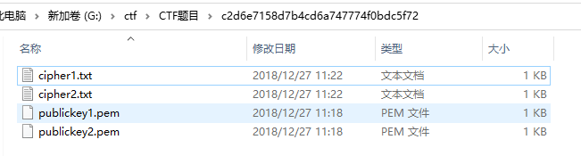
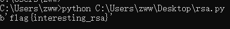

[题目地址](https://adworld.xctf.org.cn/task/answer?type=crypto&number=5&grade=1&id=5450&page=2)

题目名称：best_rsa

题目描述：暂无

题目附件：[附件1](https://adworld.xctf.org.cn/media/task/attachments/c2d6e7158d7b4cd6a747774f0bdc5f72.zip)

<!-- more -->

WriteUp：

解题思路：

下载附件，解压后打开文件夹，包含4个文件



给出了2个公钥文件和和2个密文文件，用常规的RSA解密方式分别解密，解密失败（n为2048位难以分解）

猜想应该是同一个明文，使用了2个不同的公钥加密得到了不同的密文，对同一明文的多次加密使用相同的模数和不同的公钥指数可能导致**共模攻击**

**共模攻击适用情况：**明文m、模数n相同，公钥指数e、密文c不同，gcd(e1,e2)==1也就是e1和e2互质

**解题过程:**

判断e1和e2是否互质的python3脚本如下

```python
# -*- coding: cp936 -*-
#判断两个数是否互素
 
def gcd(a, b):  # 判断来两个数是否互素,辗转相除法
    if (b == 0):
        return a
    else:
        return gcd(b, a % b)
def main():
    x = 117  # x,y的值根据需要修改即可
    y = 65537
    if gcd(x, y) == 1:  # 如果两个数的最大公约数是1，那么两数互素。
        print(str(x) + " " + str(y) + "  两个数互素")
    else:
        print(str(x) + " " + str(y) + " 两个数不互素")
 
 
if __name__ == "__main__":
    main()
```

共模攻击python3解密脚本如下：

```python
# -*- coding: cp936 -*-
import gmpy2
from Crypto.Util.number import *
from Crypto.PublicKey import RSA

#若给出公钥文件，从公钥文件中分解出n和e
public_key1 = RSA.importKey(open(r"G:\ctf\CTF题目\c2d6e7158d7b4cd6a747774f0bdc5f72\publickey1.pem",'rb').read())
public_key2 = RSA.importKey(open(r"G:\ctf\CTF题目\c2d6e7158d7b4cd6a747774f0bdc5f72\publickey2.pem",'rb').read())
#int型
n1 = public_key1.n
e1 = public_key1.e
n2 = public_key2.n
e2 = public_key2.e

assert n1==n2
n=n1

#若直接给出e1、e2、n
# e1 = 117
# e2 = 65537
# n =0x67755F890795644EC27E68892B94042C78334C34F9A6D8B6AA488D9B424D64A8B9B2DCC91B1D098A09D7AC4F9A06A4B5267F88F8968B4BAD29235D9A80330845F126B9A865F44C7A77DF72F763F553E99020745F40C8D97F0AB906154FBB1020B588F441F712B2377505B644FE36A78743EE4995B42C7B17B8DF4782EBB595097EE1BE74143261893C4EE2C140DC469E32B17F8AB30E25F07164506B4E79C6B4E3AF5BEA0268427FFB1134FB90A5122729C4EEF17B6D0B12CFBA4E7F14E27AA3C2B4F978E75163242EBD5CBD73829336F9A120E86E25D69CAE0229FDCCEB5B35DC630187B0EEF1532EEC546F4037A6EAB0D0207199B9566011A52F8E9ACD7261

c1=bytes_to_long(open(r'G:\ctf\CTF题目\c2d6e7158d7b4cd6a747774f0bdc5f72\cipher1.txt','rb').read())  
c2=bytes_to_long(open(r'G:\ctf\CTF题目\c2d6e7158d7b4cd6a747774f0bdc5f72\cipher2.txt','rb').read()) 

_, r, s = gmpy2.gcdext(e1, e2)

m = pow(c1, r, n) * pow(c2, s, n) % n
print(long_to_bytes(m))
```

运行结果：



得到flag为：flag{interesting_rsa}